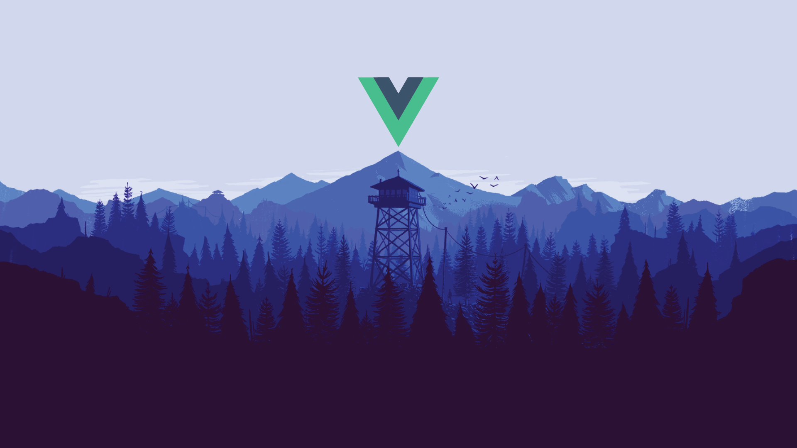

<!-- truncate -->

### Overview

[See official site](https://vuejs.org/)

Vue JS is a modern JavaScript framework that uses Node, webpack bundling, and ES modules. It is great for creating user interfaces because Vue falls into the "View" category of the [MVC](https://en.wikipedia.org/wiki/Model%E2%80%93view%E2%80%93controller) model of modern web development. It's possible to add third party libraries like Three JS, GSAP to add more sophisticated animations and 3D spaces.

### Vue Router

[Vue Router docs](https://router.vuejs.org/)

The official router for Vue JS. A single page app requires a different kind of routing system than the traditional method of loading a new page for each link. In SPA's, there is only one page that gets loaded but the DOM can be manipulated with JavaScript. This is great if you want a site that feels like a **real time** application, similar to [AJAX](https://www.w3schools.com/xml/ajax_intro.asp).

### Vite

[Vite Docs](https://vitejs.dev/)

From the official docs:

> Vite (French word for "quick", pronounced /vit/, like "veet") is a build tool that aims to provide a faster and leaner development experience for modern web projects.

The two main parts are the **dev server** and uses the **Rollup** bundling tool to make servers super fast. I use Vite with all my projects because the developer experience is much nicer.

### Nuxt

[Official site](https://nuxtjs.org/)

Nuxt is a framework built on top of Vue JS. It has many features that make it a production ready framework which is great for building modern applications. It's SEO friendly, and can use most modern UI frameworks like [Tailwind CSS](https://tailwindcss.com/).

### Mobile

Building mobile apps is a big thing these days. So many users first look up information on their phones and so having a mobile native app can be a great way of connecting with them. There are several frameworks which make it easy to build mobile native apps for iOS and Android.

Below is a link to Ionic which is intuitive and easy to setup. There is a learning curve but being familiar with Vue JS it's not a big hurdle.

#### Ionic

[Official website](https://ionicframework.com/)

### E-Commerce

It is possible to use Vue for popular e-commerce platforms. The preferred way is to use a [headless CMS](https://jamstack.org/headless-cms/) with a REST API and hook it up to the frontend with Vue.

#### Vue Storefront

[Official website](https://www.vuestorefront.io/)

### Netlify

When visiting Vue JS apps, this code snippet will make sure that you can go to any page without having to go through the home page.

```toml
# The following redirect is intended for use with most SPA's that handles routing internally.
[[redirects]]
  from = "/*"
  to = "/index.html"
  status = 200
```

### CSS

Use this code if you want to use GSAP and not mess up the page overflow.

```css
body,
html {
  display: block;
  width: 100%;
  margin: 0px;
  padding: 0px;
  overflow-x: hidden;
}
```

### Fontawesome CDN

Some scripts I use to add icons and Lottie files.

```html
<!-- FONT AWESOME -->
<link
  rel="stylesheet"
  href="https://cdnjs.cloudflare.com/ajax/libs/font-awesome/6.1.1/css/all.min.css"
  integrity="sha512-KfkfwYDsLkIlwQp6LFnl8zNdLGxu9YAA1QvwINks4PhcElQSvqcyVLLD9aMhXd13uQjoXtEKNosOWaZqXgel0g=="
  crossorigin="anonymous"
  referrerpolicy="no-referrer"
/>
```

### Lottie files

```html
<!-- LOTTIE -->
<script src="https://unpkg.com/@lottiefiles/lottie-player@latest/dist/lottie-player.js"></script>

<lottie-player
  src="https://assets1.lottiefiles.com/packages/lf20_vfmyxu76.json"
  background="transparent"
  speed="1"
  loop
  autoplay
  class="opacity-50"
  style="width: 100px; height: 100px"
></lottie-player>
```

### GSAP

[Official website](https://greensock.com/)

[Cheat Sheet](https://greensock.com/cheatsheet/)

GSAP is a great JavaScript library for creating modern animations on the web. I use it pretty much for all my Vue JS projects because it's powerful and intuitive.

#### Scroll Trigger

The following code are references for scrolling animation techniques.

#### Imports

```js
// GSAP
import { gsap } from "gsap";
import ScrollTrigger from "gsap/ScrollTrigger";
import { onMounted } from "@vue/runtime-core";
gsap.registerPlugin(ScrollTrigger);
```

### Vue Component

This snippet scales up an `#element` as the user scrolls by. The opacity and scale are set to `0` and starts animating at the bottom of the page. When the page is halfway through, the `#element` is fully scaled and the opacity is set to `1` which is 100%.

```js
export default {
  setup() {
    onMounted(() => {
      //IMAGE
      gsap.set("#element", { scale: 0, opacity: 0 });
      gsap.to("#element", {
        scrollTrigger: {
          trigger: "#element",
          scrub: 1,
          start: "top bottom",
          end: "top center",
        },
        scale: 1,
        opacity: 1,
        ease: "none",
        duration: 3,
      });
    });
  },
};
```

Based on this simple code reference, it is possible to switch it up by using `x,y` values for `position` and other cool effects. This is just the tip of the iceberg.

### Pinia

[Pinia Docs](https://pinia.vuejs.org/) is the new state management for Vue JS. It basically the next iteration of VueX. The main difference is that there is no 'mutations' which was deemed to be _extremely_ verbose. The following snippet is a reference to get the Algo price from the Cryptocompare API in USD and display it in a Vue JS template.

#### Pinia Store

```js
import { defineStore } from "pinia";
import axios from "axios";

export const usePriceStore = defineStore("price", {
  state: () => ({
    price: "",
  }),
  getters: {
    getPrice(state) {
      return state.price;
    },
  },
  actions: {
    async fetchPrice() {
      try {
        const data = await axios.get(
          "https://min-api.cryptocompare.com/data/price?fsym=BTC&tsyms=USD"
        );
        this.price = data.data;
      } catch (error) {
        alert(error);
        console.log(error);
      }
    },
  },
});
```

#### Display Price

```html
<template>
  <section class="flex justify-center bg-gray-900 text-white py-20">
    <div class="lg:w-2/4 grid lg:grid-cols-4 place-items-center text-center">
      <!-- GRID COL1 -->
      <div>
        <h1 class="lg:text-6xl font-bold text-2xl" v-if="price">
          {{ price.USD }}
        </h1>
        <p class="uppercase my-4">{{ msg }}</p>
      </div>
    </div>
  </section>
</template>

<script setup>
  import { ref, onMounted, computed } from "vue";
  import { usePriceStore } from "../stores/price";

  const store = usePriceStore();
  const msg = ref("BTC USD");
  const price = computed(() => {
    return store.price;
  });

  onMounted(() => {
    store.fetchPrice();
  });
</script>
```

### Vue 3 Marquee

Using a marquee in Vue JS is really easy. First you need to install the node package for Vue 3, include it in the `main.js` file, define the `data` and create a `v-for` loop in the HTML.

#### Install

```bash
npm install vue3-marquee
```

#### `main.js`

```js
//Vue3 Marquee
import Vue3Marquee from "vue3-marquee";
import "vue3-marquee/dist/style.css";

app.use(Vue3Marquee);
```

#### HTML

```html
<Vue3Marquee class="overflow-hidden sm:w-full" id="marquee">
  <h3
    v-for="(word, index) in test"
    :key="index"
    :class="{ word: true, odd: index % 2 === 0, even: index % 2 === 1 }"
    class="font-bold text-8xl text-white text-opacity-10 uppercase p-4"
  >
    {{ word }}
  </h3>
</Vue3Marquee>
```

#### Script

```js
export default {
  name: "VueEcosystem",
  components: {
    TabsEcosystem,
  },
  data() {
    return {
      test: [
        "Vue JS",
        " | ",
        "Satoshi Nakamoto ",
        " | ",
        "Algorand ",
        " | ",
        "Polygon ",
        " | ",
        "Carbon Neutral blockchain ",
        " | ",
        "E-Commerce ",
        " | ",
        "Web3 ",
        " | ",
        "Stablecoins ",
        " | ",
      ],
    };
  },
};
```

### Responsive Nav

The following code snippets is a reference code for creating a top nav bar that works for desktop and mobile.

There is no styling, only the `HTML` and the `JavaScript`.

```html
<template>
  <div
    class="bg-slate-900/80 fixed top w-full shadow z-50 backdrop-blur-md p-2"
  >
    <nav
      class="container py-2 mx-auto md:flex md:justify-between md:items-center"
    >
      <div class="flex items-center justify-between">
        <router-link to="/" class="hover:text-green-600">
          
        </router-link>

        <!-- MOBILE MENU BUTTON -->
        <div @click="toggleNav" class="flex md:hidden">
          <button
            type="button"
            class="text-gray-500 hover:text-orange-400 focus:outline-none focus:text-gray-900"
          >
            <svg viewBox="0 0 24 24" class="w-6 h-6 fill-current">
              <path
                fill-rule="evenodd"
                d="M4 5h16a1 1 0 0 1 0 2H4a1 1 0 1 1 0-2zm0 6h16a1 1 0 0 1 0 2H4a1 1 0 0 1 0-2zm0 6h16a1 1 0 0 1 0 2H4a1 1 0 0 1 0-2z"
              ></path>
            </svg>
          </button>
        </div>
      </div>

      <!-- MOBILE OPEN -->
      <div
        :class="showMenu ? 'flex' : 'hidden'"
        class="flex-col mt-8 space-y-4 md:flex md:space-y-0 md:flex-row md:items-center md:space-x-10 md:mt-0 text-white text-sm"
        @click="showMenu == !showMenu"
      >
        <router-link to="/about" class="hover:text-blue-500">About</router-link>
        <router-link to="/music" class="hover:text-blue-500">Music</router-link>
        <router-link to="/blog" class="hover:text-blue-500">Blog</router-link>
        <!-- 
        <router-link to="/wallet" class="hover:text-blue-500"
          >Invest</router-link
        >
        -->
        <router-link to="/wallet" class="hover:text-blue-500">Vote</router-link>
        <router-link to="/collab" class="hover:text-blue-500"
          >Collaborate</router-link
        >
        <a
          href="https://endeavr-docs.netlify.app"
          target="_blank"
          rel="noopener noreferrer"
          class="hover:text-blue-500"
          >Docs</a
        >
      </div>
    </nav>
  </div>

  <router-view />
</template>
```

The `script` section contains the following code to toggle the Nav in responsive mode.

```html
<script>
  import { ref } from "vue";

  export default {
    setup() {
      let showMenu = ref(false);
      const toggleNav = () => (showMenu.value = !showMenu.value);
      return { showMenu, toggleNav };
    },
  };
</script>
```
