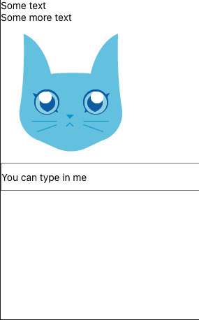

[React](https://reactjs.org) JS is a JavaScript library for creating User Interfaces. It was created at Facebook and is very popular as most jobs for frontend development require knowledge of React.

This blog will briefly go through all the major concepts for using React. Mastering the basics will give you a solid foundation on which to build well made user interfaces that are a joy to use.

<!-- truncate -->

### Virtual DOM

React works by creating a virtual DOM in memory which can then be manipulated. These changes in state are then rendered onto the page.

### CDN

If you wish to use the CDN links instead of creating a basic installation, use these. This blog however will focus on creating a full `react` app using the methods described below.

```html
<script src="https://unpkg.com/react@18/umd/react.development.js"></script>
<script src="https://unpkg.com/react-dom@18/umd/react-dom.development.js"></script>
<script src="https://unpkg.com/@babel/standalone/babel.min.js"></script>
```

### Installation

There are several ways to install React. The official way created by the React team is as follows:

```bash
npx create-react-app my-project
cd my-project
npm start
```

The script above will create a React project. In order to run it, you must first open the folder and then run the final command which will render the landing page.

There other way, which I prefer, is with [Vite](https://vitejs.dev) because it's faster and I see fewer errors when installing other packages like [Tailwind](https://tailwindcss.com/), [Three](https://threejs.org/), and [GSAP](https://greensock.com/gsap/)

```bash
npm init vite@latest
cd project-name
npm install
npm run dev
```

This will prompt a number of options which require a selection. What is neat about this is that you can choose either JavaScript or [Typescript](https://www.typescriptlang.org/).

### `index.js`

The following code is a required for a basic setup. We import `React` and `ReactDOM` and create a `root` so that we can display our components, in this case `<App />`.

```jsx
import React from "react";
import ReactDOM from "react-dom/client";

function App() {
  return <h1>Hello World!</h1>;
}

const root = ReactDOM.createRoot(document.getElementById("root"));
root.render(<App />);
```

:::info
using `createRoot` is the preferred method of rendering JSX onto a webpage.
The root node does NOT have to be a `div` element and it does NOT have to have the `id='root'`:
:::

### JSX

JSX stands for JavaScript XML. This allows you to write HTML **in** JavaScript which is why having a good foundation in programming is essential to using React.

#### Example with JSX

```jsx
const newVar = <h1>This is HTML in JS</h1>;

const root = ReactDOM.createRoot(document.getElementById("root"));
root.render(newVar);
```

#### Example without JSX

```jsx
const withoutJSX = React.createElement("h1", {}, "No JSX!");

const root = ReactDOM.createRoot(document.getElementById("root"));
root.render(withoutJSX);
```

:::info
`class` is a [reserved](https://www.w3schools.com/js/js_reserved.asp) word in JavaScript so `className` is used instead.
:::

Expressions in `JSX`

```jsx
const anExpression = (
  <h1>You can add numbers together in JSX, like 4 x 4 is {4 * 4}.</h1>
);
```

### Components

Components are the building blocks of a react app. They are reusable chuncks of code that perform specific functions and output the results.

:::tip
components MUST start with an upper case letter
:::

#### Class Component

```jsx
class Car extends React.Component {
  render() {
    return <h2>Hi, I am a car!</h2>;
  }
}
```

:::info
It is now suggested to use Function components along with Hooks, which were added in React 16.8.
:::

#### Function Component

```jsx
function Car() {
  return <h2>Hi I am a car</h2>;
}
```

### Props

Props are arguments that are passed into React components.

Example as a variable

```jsx
const propVar = <Car brand="Lexus" />;
```

Example with a functional component

```jsx
function Car(props) {
  return <h2>I am a {props.brand}!</h2>;
}
```

### Events

Events refer to user interactions on the page. In terms of syntax they have the following characteristics:

- camelCase
- Event handlers are written inside curly braces

`onClick={loose}`

```jsx
<button onClick={loose}>Knock! Draw! Loose!</button>
```

```jsx
function Arrow() {
  const fire = () => {
    alert("Well Done!");
  };

  return <button onClick={fire}>Loose!</button>;
}

const root = ReactDOM.createRoot(document.getElementById("root"));
root.render(<Arrow />);
```

#### Passing Arguments

```jsx
function Arrow() {
  const loose = (a) => {
    alert(a);
  };

  return <button onClick={() => loose("Knock! Draw! Loose!")}>Fire!</button>;
}

const root = ReactDOM.createRoot(document.getElementById("root"));
root.render(<Arrow />);
```

#### Example 2

In the following example, we are passing two arguments, `a`, `b`, into the arrow function called `shoot`. It will alert us as to what type of event triggered this alert message. We then use another arrow function in the `<button>` and pass `event` as an argument so that we get a result that tells us the type of event. And that is what happens if you click the button

```jsx
function Football() {
  const shoot = (a, b) => {
    alert(b.type);
  };

  return (
    <button onClick={(event) => shoot("Goal!", event)}>Take the shot!</button>
  );
}

const root = ReactDOM.createRoot(document.getElementById("root"));
root.render(<Football />);
```

### Conditionals

Being able to render components based on conditions is easily achieved. There are several ways to do this. We will explore the `if` statement, the logical `&&` operator, and the ternary operator.

1. `if`

```jsx
function MissedGoal() {
  return <h1>MISSED!</h1>;
}

function MadeGoal() {
  return <h1>GOAL!</h1>;
}

function Goal(props) {
  const isGoal = props.isGoal;
  if (isGoal) {
    return <MadeGoal />;
  }
  return <MissedGoal />;
}

const root = ReactDOM.createRoot(document.getElementById("root"));
root.render(<Goal isGoal={false} />);
```

2. `&&`

```jsx
function Garage(props) {
  const cars = props.cars;
  return (
    <>
      <h1>Garage</h1>
      {cars.length > 0 && <h2>You have {cars.length} cars in your garage.</h2>}
    </>
  );
}

const cars = ["Cadillac", "Lexus"];

const root = ReactDOM.createRoot(document.getElementById("root"));
root.render(<Garage cars={cars} />);
```

3. Ternary operator

```jsx
function MadeGoal() {
  return <h1>GOAL!</h1>;
}

function MissedGoal() {
  return <h1>MISSED!</h1>;
}

function Goal(props) {
  const isGoal = props.isGoal;
  return <>{isGoal ? <MadeGoal /> : <MissedGoal />}</>;
}

const root = ReactDOM.createRoot(document.getElementById("root"));
root.render(<Goal isGoal={false} />);
```

### Lists

In order to render a list, the preferred method in React is to use the `map()` array method.

For example the following code maps the items in the `car` array onto a new array using the `map()` array method which displays it on the page. Note that without a key, `react` will throw an erro.

```jsx
import React from 'react'
import ReactDOM from 'react-dom/client'

function Car(props) {
  return <li>I am a {props.brand}</l1>
}

function Garage() {
  const cars = [
    {id: 1, brand: 'Cadillac'},
    {id: 2, brand: 'Lexus'}
  ]
  return (
    <>
      <h1>Cars in the garage</h1>
      <ul>
        {cars.map((car) => <Car key={car.id} brand={car} />)}
      </ul>
    </>
  )
}

const root = ReactDOM.createRoot(document.getElementById('root'))
root.render(<Garage />)
```

### Forms

Modern apps will require some kind of input from the user. This is where forms come in. In order to use forms, we need to use the `useState` hook to get an initial state and then use a `handleChange` arrow function to show changes to the state.

#### Query

The following code has a simple input field where you can type your name. When you click `Submit Query` an alert pops up with the name that you used.

```jsx
import { useState } from "react";
import ReactDOM from "react-dom/client";

function MyForm() {
  const [name, setname] = useState("");

  const handleSubmit = (event) => {
    event.preventDefault();
    alert(`Your name is: ${name}`);
  };

  return (
    <form onSubmit={handleSubmit}>
      <label>
        Enter your name:
        <input
          type="text"
          value={name}
          onChange={(e) => setName(e.target.value)}
        />
      </label>
      <input type="submit" />
    </form>
  );
}

const root = ReactDOM.createRoot(document.getElementById("root"));
root.render(<MyForm />);
```

#### Select

```jsx
import { useState } from 'react'
import ReactDOM from 'react-dom/client'

function MyForm() {
  const [myCar, setMyCar] = useState("Volvo")

  const handleChange = (event) => {
    setMyCar(event.target.value)
  }

  return (
    <form>
      <select value={myCar} onChange={}>
        <option value="Form">Ford</option>
        <option value="Volvo">Volvo</option>
        <option value="Fiat">Fiat</option>
      </select>
    </form>
  )
}

const root = ReactDOM.createRoot(document.getElementById('root'))
root.render(<MyForm />)
```

### Router

#### Install the router

```bash
npm i -D react-router-dom
```

In order to use the router, it is important to structure the app as the following:

`src\pages\:`

- `Layout.js`
- `Home.js`
- `Blogs.js`
- `Contact.js`

`index.js`

```jsx
import ReactDOM from "react-dom/client";
import { BrowserRouter, Routes, Route } from "react-router-dom";
import Layout from "./pages/Layout";
import Home from "./pages/Home";
import Blogs from "./pages/Blogs";
import Contact from "./pages/Contact";

export default function App() {
  return (
    <BrowserRouter>
      <Routes>
        <Route path="/" element={<Layout />}>
          <Route index element={<Home />} />
          <Route path="blogs" element={<Blogs />} />
          <Route path="contact" element={<Contact />} />
        </Route>
      </Routes>
    </BrowserRouter>
  );
}

const root = ReactDOM.createRoot(document.getElementById("root"));
root.render(<App />);
```

`Layout.js`

```jsx title="/src/components/Layout.js"
import { Outlet, Link } from "react-router-dom";

const Layout = () => {
  return (
    <>
      <nav>
        <Link to="/">Home</Link>
        <Link to="/blogs">Blogs</Link>
        <Link to="/contact">Contact</Link>
      </nav>
      <Outlet />
    </>
  );
};

export default Layout;
```

`Home.js`

```jsx
const Home = () => {
  return (
    <section>
      <div>
        <h1>Home</h1>
      </div>
    </section>
  );
};

export default Home;
```

### Memo

Using Memo can enhance performance by not rendering a component whose props have not changed.

We need a separate file called `Todos.js` where our Memo logic will live. Consider this ToDo example:

```jsx
import { useState } from "react";
import ReactDOM from "react-dom/client";

const App = () => {
  const [count, setCount] = useState(0);
  const [todos, setTodos] = useState("todo 1", "todo 2");

  const increment = () => {
    setCount((c) => c + 1);
  };

  return (
    <>
      <Todos todos={todos} />
      <hr />
      <div>
        Count: {count}
        <button onClick={increment}>+</button>
      </div>
    </>
  );
};

const root = ReactDOM.createRoot(document.getElementById("root"));
root.render(<App />);
```

`Todos.js`

```jsx
import { memo } from "react"

const Todos = ({"child render"})
return (
  <>
    <h2>My Todos</h2>
    {todos.map((todo, index) => {
      return <p key={index}>{todo}</p>
    })}
  </>
)

export default memo(Todos)
```

### Hooks

Hooks were introduced to React in 16.8. They allow you to access state and other features in function components. For this reason, class components are generally not used much anymore.

There are 3 rules for hooks:

- Hooks can only be called inside React function components.
- Hooks can only be called at the top level of a component.
- Hooks cannot be conditional

#### useState

`useState` is used to track state in a function component. What this means is, when we want to add data to an application, it must first be setup with a state so that React can track any changes made to it. The logic is determined by the kind of data and its purpose.

The first thing to do is to import it. This is essentially destructuring the `useState` hook from `react`.

```jsx
import { useState } from "react";
```

```jsx
import { useState, useEffect } from "react";
import ReactDOM from "react-dom/client";

function Timer() {
  const [count, setCount] = useState(0);

  useEffect(() => {
    setTimeout(() => {
      setCount((count) => count + 1);
    }, 1000);
  });

  return <h2>I've rendered {count} times!</h2>;
}

const root = ReactDOM.createRoot(document.getElementById("root"));
root.render(<Timer />);
```

#### useEffect

The `useEffect` hook allows you to fetch data, update the dom, animate elements and so on.

Basic syntax:
`useEffect(<function>, <dependency>)`

Below is a common example of fetching data with `useEffect` using `axios`.

```jsx
import React, { useState, useEffect } from "react";
import axios from "axios";

export default function App() {
  const [data, setData] = useState({ hits: [] });

  useEffect(async () => {
    const result = await axios(
      "https://hn.algolia.com/api/v1/search?query=redux"
    );

    setData(result.data);
  }, []);

  return (
    <ul>
      {data.hits.map((item) => (
        <li key={item.objectID}>
          <a href={item.url}>{item.url}</a>
        </li>
      ))}
    </ul>
  );
}
```

#### useContext

This hook allows you to manage state globally. This is important if you have a lot of components and you need to pass props to each one (aka Prop drilling).

First import it, and then initialize it.

```jsx
import { useState, createContext } from "react";
import ReactDOM from "react-dom/client";

const UserContext = createContext();
```

#### useRef

`useRef` has several uses which include:

- Allows you to persist values between renders
- Store a mutable value that does no cause a re-render when updated
- Access a DOM element directly

It only returns one item, an object called `current`. When you initialize `useRef`, set the initial value to `useRef(0)`

```js
const count = { current: 0 };
```

and then we can access the count with `count.current`.

Example with input:

```jsx
import { useState, useEffect, useRef } from "react";
import ReactDOM from "react-dom/client";

function App() {
  const [inputValue, setInputValue] = useState("");
  const count = useRef(0);

  useEffect(() => {
    count.current = count.current + 1;
  });

  return (
    <>
      <input
        type="text"
        value={inputValue}
        onChange={(e) => setInputValue(e.target.value)}
      />
      <h1>Render Count: {count.current}</h1>
    </>
  );
}

const root = ReactDOM.createRoot(document.getElementById("root"));
root.render(<App />);
```

#### useReducer

#### useCallback

#### useMemo

#### Custom Hook

The following code is a condensed way of fetching data from an API. It uses the built in `fetch` function which converts the raw JSON and applies it to `setData` state. Finally it returns the data so that it can be used in another component where we only need to supply a URL.

```jsx title="/src/components/useFetch.js"
import { useState, useEffect } from "react";

const useFetch = (url) => {
  const [data, setData] = useState(null);

  useEffect(() => {
    fetch(url)
      .then((res) => res.json())
      .then((data) => setData(data));
  }, [url]);

  return [data];
};

export default useFetch;
```

By importing the component above into our `index.js` we can then use it to fetch data from any URL.

```jsx title="/src/index.js"
import ReactDOM from "react-dom/client";
import useFetch from "./component/useFetch";

const Home = () => {
  const [data] = useFetch("https://jsonplaceholder.typicode.com/todos");

  return (
    <>
      {data &&
        data.map((item) => {
          return <p key={item.id}>{item.title}</p>;
        })}
    </>
  );
};

const root = ReactDOM.createRoot(document.getElementById("root"));
root.render(<Home />);
```

### React ES6

#### Variables

There are three ways of defining a variable in ES6, `var`, `let`, `const`

`var`

```js
var x = 10;
```

:::tip
`var` has a **function** scope, not a **block** scope
:::

- If you use `var` outside of a function, it belongs to the global scope.

- If you use `var` inside of a function, it belongs to that function.

- If you use `var` inside of a block, i.e. a for loop, the variable is still available outside of that block.

`let` is limited to the block or expression where it is defined.

```js
let y = 2;
```

:::tip
`let` has a **block** scope
:::

`const` is a variable that once it's defined, its value can never change

```js
const z = 1206;
```

| CAN                                      | CANNOT                     |
| ---------------------------------------- | -------------------------- |
| Change the elements of constant array    | Reassign a constant value  |
| Change the properties of constant object | Reassign a constant array  |
|                                          | Reassign a constant object |

#### Arrow functions

Arrow functions are a shorter way of writing functions.

Before:

```js
hello = function () {
  return "Hello World!";
};
```

After:

```js
hello = () => {
  return "Hello World!";
};
```

Even shorter:

```js
hellp = () => "Hello World!";
```

:::info
this only works of the function has only one statement
:::

#### Destructuring

Destructuring makes it easy to extract only what is needed from an array or object and assign the values to another variable.

Destructuring an array that returns an array. This is quite common in React.

1. Example 1

```js
function calculate(a, b) {
  const add = a + b;
  const subtract = a - b;
  const multiply = a * b;
  const divide = a / b;

  return [add, subtract, multiply, divide];
}

const [add, subtract, multiply, divide] = calculate(4, 7);
```

2. Example 2

```js
// with destructuring
const objects = ["mac mini", "bow and arrows", "jackson guitar"];
const [computer, hobby, instrument] = objects;

// without destructuring
const computer = objects[0];
const hobby = objects[1];
const instrument = objects[2];
```

3. Destructuring an object that is deeply nested

```js
const vehicleOne = {
  brand: "Ford",
  model: "Mustang",
  type: "car",
  year: 2021,
  color: "red",
  registration: {
    city: "Houston",
    state: "Texas",
    country: "USA",
  },
};

myVehicle(vehicleOne);

function myVehicle({ model, registration: { state } }) {
  const message = "My " + model + " is registered in " + state + ".";
}
```

4. In React

```jsx
// with destructuring
function Fruit({ apple }) {
  return <div>This is an {apple}</div>;
}

// with destructuring
function Fruit(props) {
  const { apple, iphone, car } = props;
  return <div>This is an {apple}</div>;
}

// without destructuring
function Fruit(props) {
  return <div>This is an {props.apple}</div>;
}
```

#### Spread Operator

the `...` operator allows you to copy all or part of an existing array/object into another array/object.

Simple example:

```js
const arrayOne = [1, 2, 3];
const arrayTwo = [4, 5, 6];
const arrayCombined = [...arrayOne, ...arrayTwo];
console.log(arrayCombined);
```

Example in a React component:

```jsx
import { useState } from "react";

export default function App() {
  const [person, setperson] = useState({
    id: "",
    name: "",
    age: "",
  });

  setPerson([...person, { id: 1, name: "Steve", age: "25" }]);
}
```

When expanding your app with more complexity, the spread operator helps handle data more efficiently.

#### Array Mapping

One of the most useful array methods is the `.map()` method. It can be used to generate lists in React and it allows you to run a function on each item in the array, returning a new one as the result.

```jsx
import React from "react";
import ReactDOM from "react-dom/client";

const myArray = ["apple", "banana", "orange"];
const myList = myArray.map((item) => <p>{item}</p>);

ReactDOM.render(myList, document.getElementbyId("root"));
```

There are other array methods like `filter`, `reduce`, `sort`, `includes`, `find`, `forEach`, `splice`, `concat`, `push`, `pop`, `shift`, `unshift` and so on.

#### Ternary Operator

A simplified version of an `if`/`else` statement. Ternary operators make the code more concise.

Syntax: `condition ?<expression if true> : <expression if false>`

Before:

```js
if (autheticated) {
  renderApp();
} else {
  renderLogin();
}
```

With:

```js
authentication ? renderApp() : renderLogin();
```

#### Template Literals

Using the backtick (`) allows you to use mutli-line strings, string interpolation which can have embedded JavaScript expressions and special constructs called tagged templates.

```js
conosle.log(`string text line 1
string text line 2`);
```

#### Promises

Promises are used to handle asynchronous operations in future implementations.

Promises have 3 states:

1. Pending - final result yet to be determined
2. Resolved - Success!
3. Rejected - Failure

Using `.then()`, or `.catch()` is common when using promises. Below is a code snippet which uses a promise.

```js
let promise = new Promise((resolve, reject) => {
  const i = "Promise";
  i === "Promise" ? resolve() : reject();
});

promise
  .then(() => {
    console.log("Promise resolved!");
  })
  .catch(() => {
    console.log("Promise rejected!");
  });
```

#### Fetch API

React comes with the Fetch API built in (as opposed to Axios which needs to be installed). It only takes one argument, the URL of the api you wish to use. See below for a basic example.

```js
fetch("https://example.com/music.json")
  .then((res) => res.json())
  .then((data) => setData(data));
```

#### Async/Await

Often times it's not feasible to process data one at a time, but instead it must be done asynchronously. This enables a better developer and user experience.

Consider the following code:

```js
async function asyncFunction() {
  let promise = new Promise((resolve) => {
    resolve();
  });
  let response = await promise;
  return console.log(response);
}
```

:::info
`await` can only be used inside a `async` function.
:::

#### Modules

Since React is component-based, it is important to understand what a module is and how to import/export them.

A common way of exporting a component is as follows:

```jsx
function Component() {
  return <div>This is a component</div>;
}
export default Component;
```

OR

```jsx
export default function Component() {
  return <div>This is a component</div>;
}
```

Importing them into another component is also super simple:

```jsx
import Component from "./component";

function App() {
  return <Component />;
}
```

#### `this` keyword

In Javascript `this` refers to an object.

| Overview                                                               |
| ---------------------------------------------------------------------- |
| In an object method, this refers to the object.                        |
| Alone, this refers to the global object.                               |
| In a function, this refers to the global object.                       |
| In a function, in strict mode, this is undefined.                      |
| In an event, this refers to the element that received the event.       |
| Methods like call(), apply(), and bind() can refer this to any object. |

### Tailwind CSS

The following code will install Tailwind into your React app

```bash
npm i -D tailwindcss postcss autoprefixer
npx tailwindcss init -p
```

```js title="tailwind.config.js"
/** @type {import('tailwindcss').Config} */
module.exports = {
  content: [
    // highlight-start
    "./src/**/*.{js,jsx,ts,tsx}",
    //highlight-end
  ],
  theme: {
    extend: {},
  },
  plugins: [],
};
```

```css title="src/index.css"
@tailwind base;
@tailwind components;
@tailwind utilities;
```

```bash
npm run dev
```

#### Flowbite

A library of pre-built Tailwind Components that work well with React or Next.

To install it, use this:

```bash
npm i flowbite flowbite-react
```

In the `tailwind.config.js` file, add the following lines:

```js title="tailwind.config.js"
/** @type {import('tailwindcss').Config} */
module.exports = {
  content: [
    // highlight-start
    'node_modules/flowbite-react/**/*.{js,jsx,ts,tsx}'
    //highlight-end
    "./src/**/*.{js,jsx,ts,tsx}",
  ],
  theme: {
    extend: {},
  },
  plugins: [
    // hight_start
    require('flowbite/plugin')
    // highlight_end
  ],
};
```

### Authentication

### Animation

#### GSAP

[GSAP](https://greensock.com/gsap/) allows you to create very sophisticated animations that will make any webpage come to life.

The following code is like a loading animation where 4 circles are osicallating between 2 points.

```jsx
import React, { useRef, useEffect } from "react";
import { gsap } from "gsap";

const Loader = () => {
  const blue = useRef(null);
  const red = useRef(null);
  const yellow = useRef(null);
  const green = useRef(null);

  useEffect(() => {
    gsap.fromTo(
      [blue.current, yellow.current],
      0.5,
      { y: 12 },
      { y: -12, yoyo: true, repeat: -1 }
    );
    gsap.fromTo(
      [red.current, green.current],
      0.5,
      { y: -12 },
      { y: 12, yoyo: true, repeat: -1 }
    );
  }, []);

  return (
    <svg viewBox="0 0 150 33.2" width="180" height="150">
      <circle ref={blue} cx="16.1" cy="16.6" r="16.1" fill="#527abd" />
      <circle ref={red} cx="55.2" cy="16.6" r="16.1" fill="#de4431" />
      <circle ref={yellow} cx="94.3" cy="16.6" r="16.1" fill="#f4b61a" />
      <circle ref={green} cx="133.4" cy="16.6" r="16.1" fill="#009e52" />
    </svg>
  );
};

export default Loader;
```

This code snippet is using `useRef` and `rotation` attribute to spin a box with "Hello" written on it when the page loads.

```js
import { useLayoutEffect, useRef, useState } from "react";
import { gsap } from "gsap";

function App() {
  const app = useRef();

  useLayoutEffect(() => {
    let ctx = gsap.context(() => {
      gsap.to(".box", { rotation: "+=360" });
    }, app);

    return () => ctx.revert();
  });

  return (
    <div
      ref={app}
      className="App h-screen grid place-items-center bg-violet-100"
    >
      <div className="box w-24 h-24 rounded shadow-2xl grid place-items-center bg-black text-white">
        Hello
      </div>
    </div>
  );
}

export default App;
```

### 3D

#### Three JS

[Three JS](https://threejs.org) is a popular JavaScript library that allows you to create 3D graphics.

We will be using the `react-three/fiber` package because it simplifies the code. First install it with:

```bash
npm install three @react-three/fiber @react-three/drei
```

This code creates two boxes and when you hover, it turns pink, and if you click the boxes scale up.

```jsx
import { useRef, useState } from "react";
import { Canvas, useFrame } from "@react-three/fiber";
import { OrbitControls } from "@react-three/drei";

function Box(props) {
  const ref = useRef();
  const [hovered, hover] = useState(false);
  const [clicked, click] = useState(false);

  useFrame((state, delta) => (ref.current.rotation.x += delta));

  return (
    <mesh
      {...props}
      ref={ref}
      scale={clicked ? 1.5 : 1}
      onClick={(event) => click(!click)}
      onPointerOver={(event) => hover(true)}
      onPointerOut={(event) => hover(false)}
    >
      <boxGeometry args={[1, 1, 1]} />
      <meshStandardMaterial color={hovered ? "hotpink" : "orange"} />
    </mesh>
  );
}

export default function Cubes() {
  return (
    <Canvas>
      <ambientLight intensity={0.5} />
      <spotLight position={[10, 10, 10]} angle={0.15} penumbra={1} />
      <pointLight position={[-10, -10, -10]} />
      <Box position={[-1.2, 0, 0]} />
      <Box position={[1.2, 0, 0]} />
      <OrbitControls />
    </Canvas>
  );
}
```

#### Spline

[Spline](https://spline.design/) is a very cool browser based 3D app that makes it much easier to make scenes and add interactivity. This will really spice up your React app!

Install the plugin with:

```bash
npm install @splinetool/react-spline @splinetool/runtime
```

Next under "Export", select "Code" and "React" and find the code for the component that looks like this:

```jsx
import Spline from "@splinetool/react-spline";

export default function App() {
  return (
    <div>
      <Spline scene="your-url-for-the-3d-scene" />
    </div>
  );
}
```

To test it out I used a template and changed the text to "Khan", and the result looks like this:


### ESLint and Prettier

Linting and formatting code is important to weed out any bugs beforehand that may arise from writing the wrong code.

With `npm`

```bash
npm install -D eslint prettier eslint-config-prettier
npx eslint --init
```

With `yarn`

```bash
yarn add -D eslint prettier eslint-config-prettier
yarn eslint --init
```

There will a series of questions that will ask you about your project setup such as if it's using JavaScript or Typescript.

After you have answered the questions, do the following to start using the ESLint and prettier in your project:

Create a `.eslintrc.*` file and add the following code:

```js
{
  "extends": [
    "prettier"
  ]
}
```

Create a `.prettierrc.json` file and add the following code:

```js
{
  "semi": false,
  "singleQuote": true,
  "trailingComma": "none",
  "arrowParens": "always",
  "endOfLine": "lf",
  "space-before-function-paren": false
}
```

Create a `.eslintrc.json` file and put the following code inside it:

```js
{
  "env": {
    "browser": true,
    "es2021": true
  },
  "extends": ["plugin:react/recommended", "standard"],
  "overrides": [],
  "parserOptions": {
    "ecmaVersion": "latest",
    "sourceType": "module"
  },
  "plugins": ["react"],
  "rules": {
    "space-before-function-paren": ["error", "never"],
    "react/react-in-jsx-scope": "off",
    "react/jsx-filename-extension": [1, { "extensions": [".js", ".jsx"] }] //should add ".ts" if typescript project
  }
}
```

VS Code `json` settings.

:::tip
to open the settings file use Cmd + Shift + P for MacOS
:::

Type `Preferences:Open Settings (JSON)` and add the following lines:

```js
{
  "editor.formatOnSave": true,
  "editor.defaultFormatter": "esbenp.prettier-vscode"
}
```

### Deployment

#### Netlify

[Netlify](https://www.netlify.com/) is a platform where you can deploy your React apps without paying a cent! There are different plans that cater to different needs but for our work, this is sufficient.

In order to go to any page without having to first load the home page, create a file called `netlify.toml` and add the following code:

```toml
# The following redirect is intended for use with most SPA's that handles routing internally.
[[redirects]]
  from = "/*"
  to = "/index.html"
  status = 200
```

### Lottie Files

```bash
npm i lottie-react
```

Save a JSON version of your Lottie file in `/src/assets` and load it into a component like this:

```jsx
import Lottie from "lottie-react";
import groovyWalkAnim from "../assets/groovyWalk.json";

const LottieAnim = () => {
  return <Lottie animationData={groovyWalkAnim} />;
};

export default LottieAnim;
```

### Mock API

Using [Mirage JS](https://miragejs.com/) to mock APIs is a way for frontend developers to create prototypes that feel close to the real thing. It helps to understand how the project is structured.

```jsx
import React, { useState, useEffect } from "react";
import { createServer } from "miragejs";

let server = createServer();
server.get("/api/users", { users: [{ id: 1, name: "Jay" }] });

export default function App() {
  let [users, setUsers] = useState([]);

  useEffect(() => {
    fetch("/api/users")
      .then((res) => res.json())
      .then((json) => {
        setUsers(json.users);
      });
  }, []);

  return (
    <div>
      {users.map((user) => (
        <p key={user.id} className="text-4xl">
          {user.name}
        </p>
      ))}
    </div>
  );
}
```

### Testing

[Jest](https://jestjs.io/) is a testing framework that comes with the `create-react-app` setup. It is simple to use and allows you to test the components to see if they are working properly.

First create a `__tests__` folder in `src` and create a file called `app.js`

The following code is testing our Mock API (built with Mirage JS).

#### Initialize

```js
let server;

beforeEach(() => {
  server = makeServer("test");
});

afterEach(() => {
  server.shutdown();
});
```

#### Test 1

```js
test("it shows a message when there are no reminders", async () => {
  visit("/");
  await waitForElementToBeRemoved(() => screen.getByText("Loading..."));

  expect(screen.getByText("All done!")).toBeInTheDocument();
});

test("it shows existing reminders", async () => {
  server.create("reminder", { text: "Walk the dog" });
  server.create("reminder", { text: "Take out the trash" });
  server.create("reminder", { text: "Work out" });

  visit("/");
  await waitForElementToBeRemoved(() => screen.getByText("Loading..."));

  expect(screen.getByText("Walk the dog")).toBeInTheDocument();
  expect(screen.getByText("Take out the trash")).toBeInTheDocument();
  expect(screen.getByText("Work out")).toBeInTheDocument();
});
```

### Accessibility

Accessibility is important to help those who need assistance accessing a web page. Besides the legal requirements depending on the jurisdiction, making an app accessible requires hard-coding some attributes so that screen readers can navigate and perform actions.

The important attributes to know are `aria-label`, and `aria-required`. These help assistive technology to determine what this HTML element is and how to use it.

```html
<input
  type="text"
  aria-label="{labelText}"
  aria-required="true"
  onChange="{onchangeHandler}"
  value="{inputValue}"
  name="name"
/>
```

#### Guidelines:

1. [WCAG 2](https://www.w3.org/WAI/standards-guidelines/wcag/)
1. [WAI ARIA](https://www.w3.org/TR/wai-aria-1.2/)

#### Plugins:

1. [ESLint Plugin JSX](https://github.com/jsx-eslint/eslint-plugin-jsx-a11y)
2. [Axe Core](https://github.com/dequelabs/axe-core)

### React Native

Building mobile apps is made easier with React Native.

Basic setup:

```bash
npx create-expo-app ProjectName
cd ProjectName
npm start
```

Download the [Expo Go](https://expo.dev/client) app onto your mobile device, create an account and then scan the QR code to view the app. Making changes to your code will automatically update on your mobile!

Below is a basic code snippet that shows a line of text on the screen.

```jsx
import React from "react";
import { Text, View } from "react-native";

const App = () => {
  return (
    <View style={{ flex: 1, justifyContent: "center", alignItems: "center" }}>
      <Text>Not all those who wander are lost</Text>
    </View>
  );
};

export default App;
```

#### Core Components

| React Native UI Component    | Web Analog              | Description                                                                                           |
| ---------------------------- | ----------------------- | ----------------------------------------------------------------------------------------------------- |
| `<View> </View>`             | `<div> </div>`          | A container that supports layout with flexbox, style, some touch handling, and accessibility controls |
| `<Text> </Text>`             | `<p> </p>`              | Displays, styles, and nests strings of text and even handles touch events                             |
| `<Image />`                  | ``               | Displays different types of images                                                                    |
| `<ScrollView> </ScrollView>` | `<div> </div>`          | A generic scrolling container that can contain multiple components and views                          |
| `<TextInput />`              | `<input type="text" />` | Allows the user to enter text                                                                         |

Below is a code snippet with an `Image` and `TextInput`:

```jsx
import React from "react";
import { View, Text, Image, ScrollView, TextInput } from "react-native";

const App = () => {
  return (
    <ScrollView>
      <Text>React Native</Text>
      <View>
        <Text>Text inside a 'View'</Text>
        <Image
          source={{ uri: "https://reactnative.dev/docs/assets/p_cat2.png" }}
          style={{ width: 200, height: 200 }}
        />
      </View>
      <TextInput
        style={{ height: 40, borderColor: "gray", borderWidth: 1 }}
        defaultValue="Type here!"
      />
    </ScrollView>
  );
};

export default App;
```

You should see this:


