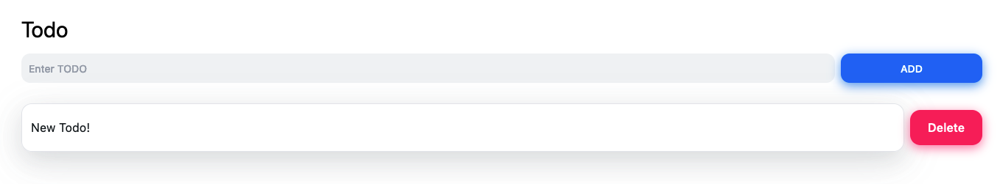

## Next JS

[Next JS](https://nextjs.org) is a React framework that optimizes and structures your app for a better developer and user experience. A basic `react` app provides a foundational toolset to build user interfaces but it still requires quite a bit of setup to make it production ready, meaning scalability, SEO optimization, accessibility, performance and so on.

<!-- truncate -->

### Fundamentals

#### Compiling

Compiling is the process of taking code in one language and outputting it in another language or a different version of the same language. This happens during the development stage (while editing code) and also at the build step prior to the production stage.

A browser needs code to be compiled in order to understand it.

#### Minifying

Developers write code so that they are able to understand it. However, this formatting is not necessary for the browser to run it. Elements such as comments, spaces, indents and multiple lines are removed and minified code looks like a giant blob of text. The functionality still remains but the file sizes are smaller which means better app performance.

#### Bundling

Bundling resolves the web of dependencies that usually accompany a typical application with its many modules, functions, components, 3rd party packages and so on. It does this my merging/packaging the files into optimized bundles for the browser. The goal is to reduce the number of requests for files when a user visits a web page.

Popular JavaScript bundlers

1. Webpack
2. esbuild
3. parcel
4. rollup
5. browserify

#### Code Splitting

By splitting the application's bundle into smaller chuncks required by each **entry point**(unique URLS), the initial load times are improved because only the required code is loaded for that page. This process is known as Code Splitting.

#### Build Time cs Runtime

**Build Time** is the series of steps that prepare your app's code for production. Modern platforms like Netlify and Vercel will handle this step when you deploy your code to a connected git repo.

The following command is used that enables the process to begin:

```bash
npm run build
```

Optimizing code for production is critical otherwise the UX will suffer. Files that are optimized include:

- HTML files for statically generated pages
- JavaScript code for rendering pages on the server
- JavaScript code for making pages interactive on the client side

After your app has been deployed and a user sends a request, that is referred to as **Runtime**.

#### Client and Server

The **client** is the browser that the user is on to interact with your application. Through this interface, requests are then sent to the backend server which returns a response to the browser.

The **server** is where your application code lives, which is usually some data center in a remote location. AWS, Google and other large corporations have immense facilities that host data.

#### Rendering

Rendering converts your React code into the HTML representation of your UI.

There are three main rendering methods. If you wish to use all of these in React, please see the `Next JS` section.

1. Server-Side Rendering

Where HTML of each page is generated on a server for **each** request. The generated HTML, JSON and JavaScript is then sent to the client.

**Hydration** is the process of making the page interactive (with JavaScript) after it has loaded the HTML.

2. Static Site Generation

Content is generated once at build time and the HTML is stored in a CDN which is re-used for each request. In other words, the HTML is generated on the server but there is no server request at runtime.

3. Client-Side Rendering

React is primarily a library to build User Interfaces on the client side. When the browser receives an empty HTML shell from the server along with the JavaScript to construct the UI, the process is all done on the **client-side**.

:::info
Pre-rendering covers both Server-Side and Static Site
:::

#### CDNs and the Edge

:::info
The **Origin** server refers to the main server where the application code lives.
:::

A CDN stores static content like HTML and image files in multiple locations around the world. This content is placed between the client and the origin server so that when a request is made, the CDN closes to the client returns the response. This make content delivery much faster resulting in a better UX.

The Edge is similar to a CDN but instead of just storing static content, the Edge network can run code (caching and code execution) closer to the user. This means that less code is sent to the client and part of the users request doesn't need to go all the way to the origin server.

:::info
**Imperative** programming tells a computer _how_ it should do something whereas **declarative** programming describes _what_ needs to be rendered (in Reacts case).
:::

### Installation

```bash
npx create-next-app@latest
```

If you want to include Taiwindcss as part of the project, use this command:

```bash
npx create-next-app@latest -e with-tailwindcss
```

```jsx
import { useState } from "react";
function Header({ title }) {
  return <h1>{title ? title : "Default Title"}</h1>;
}

export default function HomePage() {
  const name = ["Ada Lovelace", "Grace Hopper", "Margaret Hamilton"];
  const [likes, setLikes] = useState(0);

  function handleClick() {
    setLikes(likes + 1);
  }

  return (
    <div>
      <Header title="Develop. Build. Relase" />
      <ul>
        {names.map((name) => (
          <li key={name}>{name}</li>
        ))}
      </ul>

      <button onClick={handleClick}>Like ({likes})</button>
    </div>
  );
}
```

### Axios

Axios is one way of fetching data in JavaScript applications.

First install it with:

```bash
npm i axios
```

Then make a new file in the `page` folder called `bitcoin.js` and add the following code to get the price from the Coinlore API.

```jsx
import Axios from "axios";

export const getStaticProps = async () => {
  const res = await Axios.get("https://api.coinlore.net/api/ticker/?id=90");
  return {
    props: { data: res.data },
  };
};

const Bitcoin = (props) => {
  const btcprice = props.data;

  return (
    <>
      <p>BTC PRICE</p>

      {btcprice?.map((price) => {
        <div key={price.id}>
          <h1>{price.price_usd}</h1>
        </div>;
      })}
    </>
  );
};

export default Bitcoin;
```

### React Query

React Query is for managing server-side state. It removes a lot of boilerplate code associated with state management.

First install `react-query` like so:

```bash
npm i @tanstack/react-query
```

In order to use React Query, you must add a `QueryClientProvider` and `Hydrate` to the base app file, which in Next JS is found under `pages` and is called `_app.tsx`. Setup the file like so:

```tsx
import React from "react";
import type { AppProps } from "next/app";
import { Hydrate, QueryClient, QueryClientProvider } from "react-query";

export default function App({ Component, pageProps }: AppProps) {
  const queryClient = React.useRef(new QueryClient());

  return (
    <QueryClientProvider>
      <Hydrate>
        <Component {...pageProps} />
      </Hydrate>
    </QueryClientProvider>
  );
}
```

A simple script to get the BTC price from the CoinLore API using React-Query:

```tsx
import { dehydrate, QueryClient, useQuery } from "react-query";

// Types based on the API data JSON output
type BitcoinData = {
  0: {
    id: string;
    symbol: string;
    name: string;
    ranl: number;
    price_usd: string;
    tsupply: string;
    msupply: string;
    percent_change_24h: string;
  };
};

const getBitcoinData = async () =>
  await (await fetch("https://api.coinlore.net/api/ticker/?id=90")).json();

export default function Bitcoin() {
  // destructuring
  const { data, isLoading, isFetching } = useQuery<BitcoinData>(
    "bitcoin",
    getBitcoinData
  );
  // optional console log to see if it's working
  // console.log(data)

  if (isLoading) return <div>Loading...</div>;

  if (!data) return <div>Error...</div>;

  return (
    <>
      <div>
        <p>{data?.[0].name}</p>
        <p>{data?.[0].price_usd}</p>
        <p>{data?.[0].msupply}</p>
        <p>{data?.[0].rank}</p>
        <p>{data?.[0].percent_change_24h}</p>
      </div>
    </>
  );
}

// Static Props to load beforehand

export async function getStaticProps() {
  const queryClient = new QueryClient();
  await queryClient.prefetchQuery<BitconData>("bitcoin", getBitcoinData);

  return {
    props: {
      dehydrateState: dehydrate(queryClient),
    },
  };
}
```

### The NextJS 13 Way

The new experimental feature which is in Beta, is the `app` folder.

This code snippet fetches a Todos list from an API called JsonPlaceholder. It's a great way to learn how to build on some foundational knowledge.

We need to define what type of data we need to fetch first. Use this as a guide.

```ts title="/typings.d.ts"
export type Todo = {
  userId: number;
  id: number;
  title: string;
  completed: boolean;
};
```

Add the following code that uses async functions to fetch data and display the results.

```tsx title="/app/todos/TodosList.tsx"
import React from "react"
import Link from "next/link"
import { Todo } from "../../typings"

const fetchTodos = async () => {
  const res = await fetch("https://jsonplaceholder.typicode.com/todos/")
  const todos = Todo[] = await res.json()
  return todos
}

async function TodosList() {
  const todos = await fetchTodos()

  return (
    <>
      {todos.map((todo) => (
        <p key={todo.id}>
          <Link href={`/todos/${todo.id}`}>Todo: {todo.id}</Link>
        </p>
      ))}
    </>
  )
}

export default TodosList
```

and for the individual todo items:

```tsx title="/app/todos/[todoId]/page.tsx"
import React from "react";
import { Todo } from "../../typings";
import { notFound } from "next/navigation";

export const dynamicParams = true;

type PageProps = {
  params: {
    todoId: string;
  };
};

const fetchTodo = async (todoId: string) => {
  const res = await fetch(
    `https://jsonplaceholder.typicode.com/todos/${todoId}`,
    { next: { revalidate: 60 } }
  );

  const todo: Todo = await res.json();
  return todo;
};

async function TodoPage({ params: { todoId } }: PageProps) {
  const todo = await fetchTodo(todoId);

  if (!todo.id) return notFound();

  return (
    <div>
      <p>
        #{todo.id}: {todo.title}
      </p>
      <p>Completed: {todo.compeleted ? "Yes" : "No"}</p>
      {/* @ts-ignore */}
      <p>By User: {todo.userId}</p>
    </div>
  );
}

export default TodoPage;

export async function generateStaticParams() {
  const res = await fetch("https://jsonplaceholder.typicode.com/todos/");
  const todos: Todo[] = await res.json();

  const trimmedTodos = todos.splice(0, 10);

  return trimmedTodos.map((todo) => ({
    todoId: todo.id.toString(),
  }));
}
```

### Layouts

```tsx
export default function RootLayout({
  children,
}: {
  children: React.ReactNode;
}) {
  return (
    <main className="flex space-x-4 divide-x-2 p-5">
      <div>
        <h1>Search</h1>
      </div>
      <div className="flex-1 pl-5">{children}</div>
    </main>
  );
}
```

### Search

```tsx
import { useState, useEffect } from "react";

const defaultEndpoint = "https://rickandmortyapi.com/api/character/";

export async function getServerSideProps() {
  const res = await fetch(defaultEndpoint);
  const data = await res.json();
  return {
    props: {
      data,
    },
  };
}

export default function Home({ data }) {
  console.log("data", data);
  const { info, results: defaultResults = [] } = data;
  const [results, updateResults] = useState(defaultResults);
  const [page, updatePage] = useState({
    ...info,
    current: defaultEndpoint,
  });
  const { current } = page;

  useEffect(() => {
    if (current === defaultEndpoint) return;

    async function request() {
      const res = await fetch(current);
      const nextData = await res.json();

      updatePage({
        current,
        ...nextData.info,
      });

      if (!nextData.info?.prev) {
        updateResults(nextData.results);
        return;
      }

      updateResults((prev) => {
        return [...prev, ...nextData.results];
      });
    }

    request();
  }, [current]);

  function handleLoadMore() {
    updatePage((prev) => {
      return {
        ...prev,
        current: page?.next,
      };
    });
  }

  function handleOnSubmitSearch(e) {
    e.preventDefault();

    const { currentTarget = {} } = e;
    const fields = Array.from(currentTarget?.elements);
    const fieldQuery = fields.find((field) => field.name === "query");

    const value = fieldQuery.value || "";
    const endpoint = `https://rickandmortyapi.com/api/character/?name=${value}`;

    updatePage({
      current: endpoint,
    });
  }

  return (
    <form
      className="flex items-center space-x-2"
      onSubmit={handleOnSubmitSearch}
    >
      <input
        name="query"
        type="search"
        className="p-4 border rounded bg-gray-800 text-white"
        placeholder="search..."
      />
      <button className="border p-4 px-4 bg-blue-600 text-white hover:bg-slate-800 duration-300 rounded">
        Search
      </button>
    </form>
  );
}
```

### Framer Motion

```bash
npm i framer-motion
```

```tsx
import "../styles/globals.css";
import React from "react";
import type { AppProps } from "next/app";
import Nav from "../components/nav";
import { motion, AnimatePresence } from "framer-motion";
import Footer from "../components/footer";

export default function App({ Component, pageProps }: AppProps) {
  return (
    <AnimatePresence>
      <motion.div
        initial="pageInitial"
        animate="pageAnimate"
        exit="pageExit"
        variants={{
          pageInitial: {
            opacity: 0,
          },
          pageAnimate: {
            opacity: 1,
          },
          pageExit: {
            opacity: 0,
          },
        }}
      >
        <Nav />
        <Component {...pageProps} />
        <Footer />
      </motion.div>
    </AnimatePresence>
  );
}
```

#### Scrolling

```tsx
import { motion, useScroll, useTransform } from "framer-motion";

let { scrollYProgress } = useScroll();
let y = useTransform(scrollYProgress, [0, 1], ["-10%", "-50%"]);
```

#### While Hover

```tsx
<motion.li
  whileHover={{
    position: "relative",
    zIndex: 1,
    scale: [1, 2, 1.2],
    rotate: [0, 20, -10, 0],
    filter: {
      "hue-rotate(0) contrast(100%)",
      "hue-rotate(360deg) contrast(200%)",
      "hue-rotate(45deg) contrast(300%)",
      "hue-rotate(0) contrast(100%)",
    },
    transition: {
      duration: 0.2
    }
  }}
```

### Storybook

In you NextJS project run this code to get started with Storybook.

```bash
npx sb init --builder webpack5
```

Create a new file called `home.stories.tsx` in the `/stories/pages/` folder

```tsx title="/stories/pages/home.stories.tsx"
import Home from "../../pages/index";

export default {
  title: "Pages/Home",
  component: Home,
};

export const HomePage = () => <Home />;
```

I've been experiencing some issues with NextJS 13 but it should work fine with NextJS 12.

In the `.storybook/preview.ts` file, import the `globals.css` file.

```tsx
import "../styles/globals.css";
```

and finally we need to de-optimize the Images with the following 2 steps:

1. change the `package.json` file `"scripts"` to:

```json title="package.json"
"scripts": {
    "storybook": "start-storybook -p 6006 -s ./public",
    "build-storybook": "build-storybook -s public"
}
```

2. add this code snippet to the `preview.js` file in `.storybook`.

```tsx title=".storybook/preview.js"
import * as NextImage from "next/image";

const OriginalNextImage = NextImage.default;

Object.defineProperty(NextImage, "default", {
  configurable: true,
  value: (props) => <OriginalNextImage {...props} unoptimized />,
});
```

The component should now look the same in your storybook as it does on the browser.

#### Deploying to Chromatic

Install Chromatic:

```bash
npm install chromatic --save-dev
```

```bash
npm run build-storybook
```

Run the server locally to see what's up

```bash
npx http-server ./storybook-test
```

Deploy:

```bash
npx chromatic --project-token=<your-project-token>
```

### React Three Fiber

```bash
npm i three @react-three/fiber @react-three/drei
```

This code snippet will load a Ledger hardware wallet GLTF in the browser which cais interactive.

```tsx
/* eslint-disable react/no-unknown-property */
import { useLoader } from "@react-three/fiber";
import { Suspense } from "react";
import { GLTFLoader } from "three/examples/jsm/loaders/GLTFLoader";
import { Canvas } from "@react-three/fiber";
import { OrbitControls } from "@react-three/drei";
import { motion } from "framer-motion";

const Ledger = () => {
  const gltf = useLoader(GLTFLoader, "../ledger.gltf");
  return (
    <>
      <primitive object={gltf.scene} scale={8} position={[0, 0, 0]} />
    </>
  );
};

export default function LedgerScene() {
  return (
    <motion.div
      className="h-96"
      initial="hidden"
      animate="visible"
      variants={{
        hidden: {
          opacity: 0,
        },
        visible: {
          opacity: 1,
          transition: {
            delay: 0.5,
          },
        },
      }}
    >
      <Canvas camera={{ fov: 75, near: 0.1, far: 1000, position: [-2, 5, -5] }}>
        <Suspense fallback={null}>
          <ambientLight intensity={1} />
          <directionalLight position={[1, 1, 5]} castShadow />
          <Ledger />
          <OrbitControls enableZoom={false} />
        </Suspense>
      </Canvas>
    </motion.div>
  );
}
```

The 3d object in the bottom of this image is the output. To see the live version you can visit this [link](https://nozomi-digital.vercel.app/hardware/wallets)


#### Theatre JS

### Playwright

Playwright is a end-to-end testing library that supports multiple browsers and operating systems.

In order to get started with Playwright, you need a project that is already set up. Run the following command to get started:

```bash
npm init playwright@latest
```

#### Running a test

In order to run a test, use this command:

```bash
npx playwright test
```

This will run in the background and the output will let you know if the tests passed or not. If they did not pass, the logs will identify where the problem occured.

To see a report in the browser:

```bash
npx playwright show-report
```

#### Assertions

The `expect` library for test assertions provides helpful matchers like:

- `toEqual`
- `toContain`
- `toMatch`
- `toBe`

Sample test:

```tsx
import { test, expect } from "@playwright/test";

test("SEO title is present", async ({ page }) => {
  await page.goto("http://localhost:3000");
  await expect(page).toHaveTitle(/Title/);
});
```

#### Locators

Locators is how you find element(s) on a page where you can then use actions like `.click`, and `.fill`.

#### Test isolation

#### Test hooks

#### Generate tests with Codegen

### Zustand

Install it with:

```bash
# npm
npm i zustand

# yarn
yarn add zustand
```

In the `lib` folder, create a file called `store.ts` and add this code which basically counts the number of bears which increase with each button press. This can be found on their [website](https://zustand-demo.pmnd.rs/)

#### Counter store

```ts title="lib/store.ts"
import create from "zustand";

const useStore = create((set) => ({
  count: 1,
  inc: () => set((state) => ({ count: state.count + 1 })),
}));

function Controls() {
  const inc = useStore((state) => sate.inc);
  return <button onClick={inc}>one up</button>;
}

function Counter() {
  const count = useStore((state) => state.count);
  return <h1>{count}</h1>;
}
```

#### Todo store:

```js title="lib/store.js"
import create from "zustand";

const useStore = create((set) => ({
  todos: [],
  todo: "",
  addTodo: (todo) => set((state) => ({ todos: [...state.todos, todo] })),
  removeTodo: (index) =>
    set((state) => ({ todos: state.todos.filter((_, i) => i !== index) })),
}));

export default useStore;
```

This UI uses `@nextui-org/react` which you can install with the following command:

```bash
npm install @nextui-org/react
```

```jsx
import { Button, Input, Card } from "@nextui-org/react";
import { useState } from "react";
import useStore from "../lib/store";
export default function Home() {
  const [newtodo, setNewTodo] = useState("");

  const todos = useStore((state) => state.todos);
  const addTodo = useStore((state) => state.addTodo);
  const removeTodo = useStore((state) => state.removeTodo);

  // this function will check if the input is valid or not
  const AddNewTodo = () => {
    if (newtodo.length > 0) {
      addTodo(newtodo);
      setNewTodo("");
    }
  };

  return (
    <div className="container text-black mx-auto flex flex-col items-center p-28">
      <div className="w-full">
        <h1 className="text-3xl">Todo</h1>
      </div>
      <div className="mt-2 flex items-center w-full">
        <Input
          value={newtodo}
          onChange={(e) => setNewTodo(e.target.value)}
          fullWidth
          placeholder="Enter TODO"
          clearable
        ></Input>
        <Button onClick={AddNewTodo} shadow className="m-2">
          ADD
        </Button>
      </div>

      {todos.map((todo, index) => (
        <div key={index} className="mt-5 w-full flex items-center">
          <Card className="w-full">
            <Card.Body>{todo}</Card.Body>
          </Card>
          <Button
            onClick={() => removeTodo(index)}
            size="lg"
            shadow
            auto
            color="error"
            className="m-2"
          >
            Delete
          </Button>
        </div>
      ))}
    </div>
  );
}
```

you should see the following output:


