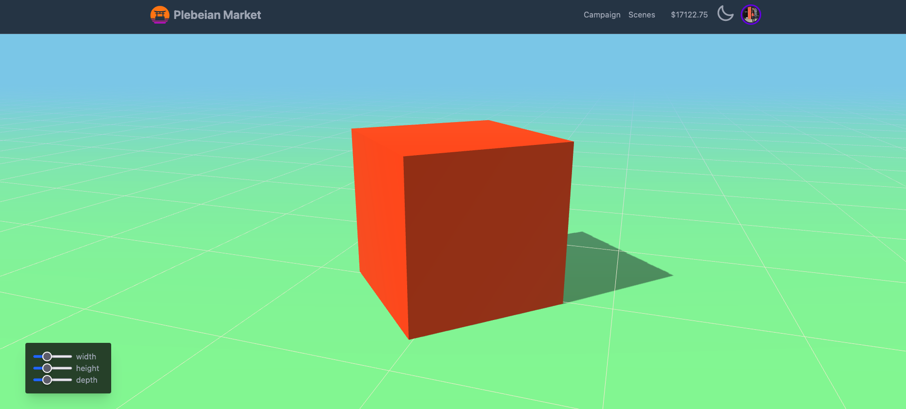

## Sveltekit

[Sveltekit](https://kit.svelte.dev/) is a new web framework which simplifies creating user interfaces with a strong focus on performance, accessibility, and developer experience.

<!-- truncate -->

### Overview

#### Folder structure

#### Comparison to other frameworks

#### Vite

### Installation

Use the following command to create a basic Sveltekit app. You can do so with NPM, Yarn, or PNPM.

```bash
npm init svelte@next project-name
```

Add Tailwindcss

```bash
npx svelte-add@latest tailwindcss
```

### Svelte-cubed

```html
<SC.Canvas
  antialias
  background={new THREE.Color("skyblue")}
  fog={new THREE.FogExp2("skyblue", 0.1)}
  shadows
>
  <SC.Group position={[0, -height / 2, 0]}>
    <SC.Mesh
      geometry={new THREE.PlaneGeometry(50, 50)}
      material={new THREE.MeshStandardMaterial({ color: "lightgreen" })}
      rotation={[-Math.PI / 2, 0, 0]}
      receiveShadow
    />
    <SC.Primitive
      object={new THREE.GridHelper(50, 50, "papayawhip", "papayawhip")}
      position={[0, 0.001, 0]}
    />
  </SC.Group>

  <SC.Mesh
    geometry={new THREE.BoxGeometry()}
    material={new THREE.MeshStandardMaterial({ color: 0xff3e00 })}
    scale={[width, height, depth]}
    rotation={[0, spin, 0]}
    castShadow
  />

  <SC.PerspectiveCamera position={[1, 1, 3]} />
  <SC.OrbitControls enableZoom={false} maxPolarAngle={Math.PI * 0.51} />
  <SC.AmbientLight intensity={0.6} />
  <SC.DirectionalLight
    intensity={0.6}
    position={[-2, 3, 2]}
    shadow={{ mapSize: [2048, 2048] }}
  />
</SC.Canvas>
```

The result can be seen in the following image or [link](https://plebeian-market.vercel.app/scenes/three)



### Dark mode
