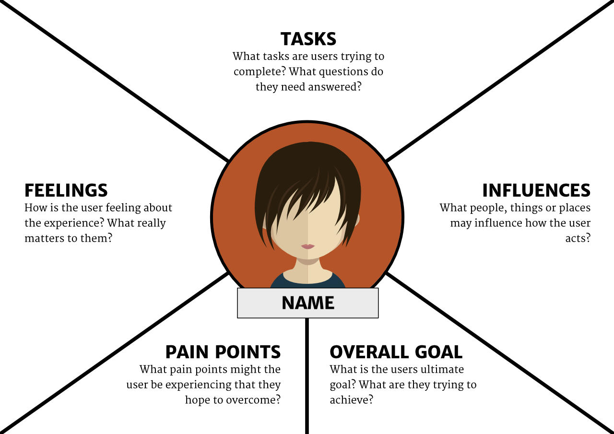
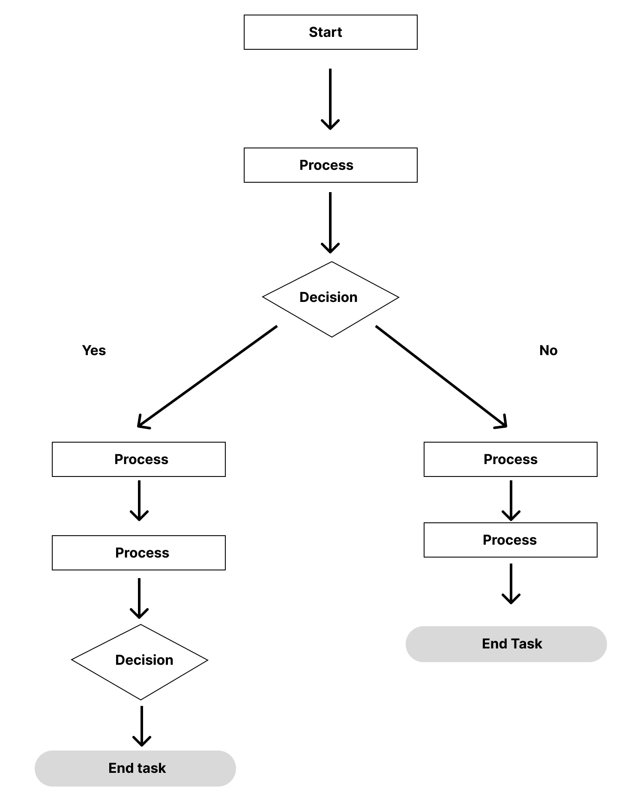

# Design Philosophy

The following philosophies were inspired by past designers and from experience learning about typography, colour theory, and layouts. These are a reminder that when designing, it is better to proceed with deliberation and focus. Inspiration can come from anywhere but a good design never feels forced.

Design is about problem solving and communication. Who is the intended audience? Is the message clear? These are some of the questions to consider when designing anything.

### Function over form

- Function will always matter more than what a design looks like
- Good design redefines itself, rapidly
- Design as a cultural artifact

### Empathy and focus

- The user may not always know what they want
- A streamlined design does its job well
- Eliminate that which does not serve the purpose of the design

### Simplicity

- Good design is as little design as possible
- It should be experienced, not seen
- Deconstructivism - break it down and put it back together, differently
- Sometimes it pays to be obvious

### Good design is pleasing

- Aim for the "WOW" factor
- Good design is instantaneously recognized
- Beauty is truth
- People react to a profound sentiment that speaks to our souls

## Design Process

I have boiled down my design process into 5 steps.

### 1. Empathize

The first and most important part of the design process is to have empathy for the user. This means that if it's possible to put a face and a name to the potential user, it becomes easier to understand what the user needs. A common way to do this is to create persona maps that highlight the background, technical skills, needs and wants, and goals of the user.

Without empathy, any design will feel like a shot in the dark. This usually results in lost revenue and a bad reputation of the product.

#### Inspiration

Design inspiration can come from _anywhere_. It is so often the case that daydreaming and just wandering for the sake of it can lead to new and novel ideas. However, it is important to note that keeping an open mind, eyes and ears is the key to finding the best ideas. A design must be **focused** but the inspiration can be derived randomly by interacting with the world.

[Cool design quote app](https://quotesondesign.com/)

#### Steve Jobs

I admire Steve Jobs for this design philosophy and it has certainly influenced me in my career. I've used Apple, Microsoft and Linux products and would pick Apple (and Linux) any day because of how carefully thought out the designs are. The designs are easy and simple to use and they hide the complexity really well.

[The Apple Marketing Philosophy by Mike Markkula](https://1000manifestos.com/mike-markkula-the-apple-marketing-philosophy/)

1. Empathy

   > An "intimate" connection with the customer’s feelings. "We will truly understand their needs better than any other company."

2. Focus

   > In order to do a good job of those things that we decide to do, we must eliminate all of the unimportant opportunities.

3. Impute
   > “People DO judge a book by its cover. We may have the best product, the highest quality, the most useful software etc.; if we represent them in a slipshod manner, they will be perceived as slipshod; if we present them in a creative, professional manner, we will impute the desired qualities. “

#### Simplicity

> Simplicity is the ultimate sophistication.

The key to success. No user wants to go through loops and ladders just to buy a simple product. Apple products are easy to use, and it would take about 10 minutes to understand how to use their OS. Compare that with Windows in which the UX is not as good and with each problem there is hours of researching how to fix something. In my opinion, the only reason Windows is more popular is because of Microsofts determination to dominate and sell their product rather than create art.

> Regardless of what your ultimate goal is, remember: _the simplest steps are the ones you don’t take._

[How Steve Jobs' #1 Design Principle Can Transform Your Daily Life](https://www.entrepreneur.com/article/369186)

### 2. Define

Understanding how you are building the project for is fundamental to design.

#### User persona template

### 3. Ideate and Collaborate

The stage where a lot of the design thinking happens.

#### User flows

- **Understand your user.** When deciding how to get users to interact with your product in a flow-like state, understanding the user’s needs and motivations allows you to make an informed choice.

- **Create a flow outline.** It can be helpful to divide your flow chart into three main stages: an entry point, the steps to completion, and the final step in completing a task or interaction.

- **Define the elements of your user flow.** Use differen shapes to represent the action. A fully rounded button is a starting and ending point. A diamond is where a decision needs to be made. A rectangle is a stage of the flow and arrows indicate the flow of the task.

- **Refine your outline.** The same principles you apply when designing an interface can and should be applied when designing a UX flowchart.

#### Wireframes

Wireframes help define the outline and layout of the website or app. This helps in having a starting point and it does not need to be super detailed or pixel perfect. In fact most likely, the design will change. Any real design goes through a process and it's best not be rigid and too singular when it comes to designing. Often ideas can come from seemingly random places and the best policy is to keep an open mind.

### 4. Prototype

Prototypes can be made with Figma and Adobe XD. Sometimes it might even be more efficient to create it with HTML/CSS and JavaScript. This would speed up the development process. rototypes should be clickable and as close to what the final product should be as possible.

#### Example from Figma

[See example prototype](https://www.figma.com/proto/lo3ommF09WtHsnwajQ7kLo/Prototyping-in-Figma?scaling=scale-down&page-id=0%3A1&starting-point-node-id=0%3A2&node-id=0%3A78)

### 5. Test

#### Functional testing:

- Feed input data and observe the output (aka black-box testing). This is for specific components to see that the intended output is achieved. For example, inputting an incorrect email format should yield an error message.
- Manual testing involves trying each element in the user interface whereas automated testing works in a special testing environment and is run with scripts (i.e Selenium, Cypress).

#### Usability testing

- Speed and performance of the application. If the app loads slowly, that would be a bad user experience.
- Test the navigation for any issues and ease-of-use. A confusing navigation will put people off the application.
- Check to see if the content is formatted properly for easy consumption. No giant blocks of text in small fonts.
- Try the app on your phone or use the browser dev tools in different sizes. Common issues include misplaced elements that do not resize accordingly.

#### Cross browser testing

- Open the app in multiple browsers and look for any inconsistencies in the user interface. Common problems include CSS and functionality issues. Some features may not work on all browsers.

#### Security Testing

- Signup for the application and check to see if the authentication works as intended. This could be an email validation, or SMS. Some apps require both.
- Test data security by checking to see that important information like passwords and credit card numbers are encrypted.
