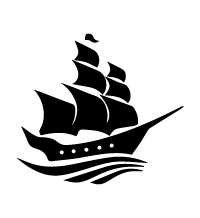
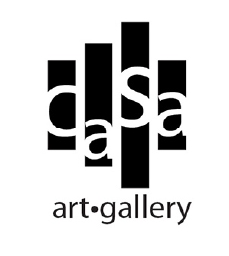
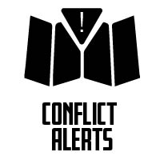
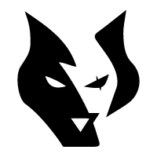

# Logos

## Sound Co.

A combination of the Zen Enso, AUM, and the bass clef, this logo is for the blockchain suite of apps under the **Sound** banner

## Endeavr

I've always enjoyed pirate stories and shows which is where the inspiration came from. I tried to keep it simple but also bold. Endeavr is the name of the ship.

## Casa Art Gallery

The client wanted a logo for their new business: an Art Gallery. I used the idea of a painting broken up into different sizes.

## Conflict Alerts

The logo is a folded map with the exclamation mark to indicate conflict. Having a hard looking font gives the impression of military conflict.

## DjWolf

A logo for a Django based CMS, similar to Wagtail but utilizing Pandas and Algorand. Dj is short for Django and Wolf refers to Howlin' Wolf.

