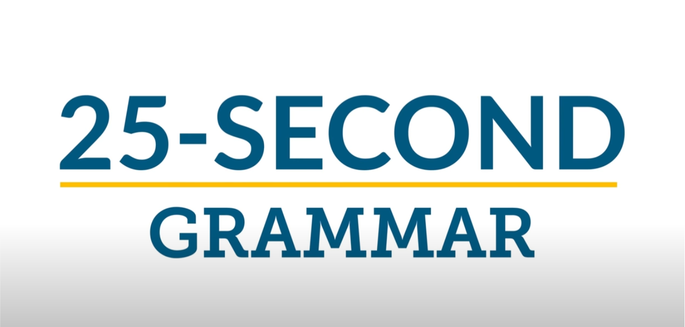
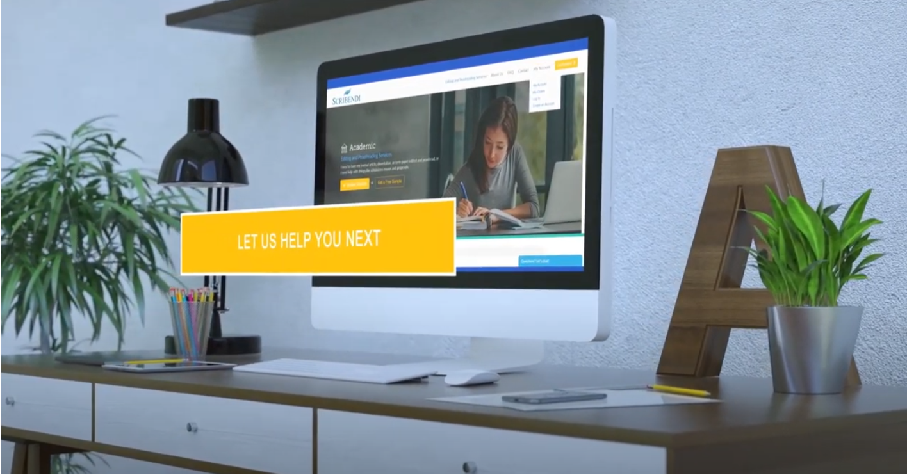
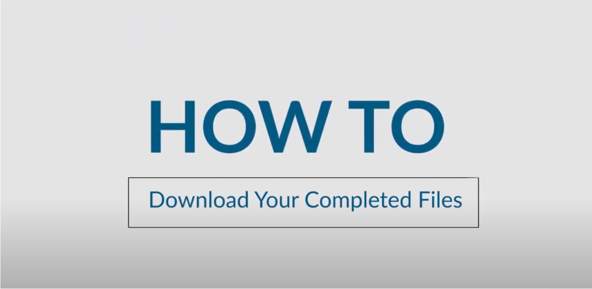

## Motion Graphics

### Scribendi

These series of videos were made for education purposes. The ESL community was the audience that were identified as being the ones most likely to consider watching the short clips of confusing English language concepts. The videos ended up getting thousands of views and so we know that there was a noticeable impact in the outreach for Scribendi.

Educational videos also show that the organization is willing to give out knowledge for free and that they know what they are talking about.

Result: The grammar videos got over 500,000 views and increased the traffic to the main Scribendi website. This told us that free educational content can help bring in new customers. The other videos got thousands of views but didn't really make a difference in terms of website traffic.

#### 25 second Grammar:

[25 second Grammar: Semicolons](https://www.youtube.com/watch?v=AhDfTdAY1cU)

[25 second Grammar: Affect vs Effect](https://www.youtube.com/watch?v=pqzTVRFveYQ)

[25 second Grammar: Accept vs Except](https://www.youtube.com/watch?v=OhyU6KuYkG4)

[25 second Grammar: Your vs You're](https://www.youtube.com/watch?v=48w_NQkj2xk)

#### Marketing

[Scribendi overview](https://www.youtube.com/watch?v=os7JezfFh8I)

[Top 10 misspellings of Scribendi](https://www.youtube.com/watch?v=lj6KnVkdQqk&t=1s)

#### Technical

[How to download your completed files](https://www.youtube.com/watch?v=wse5XM-E7i0)
