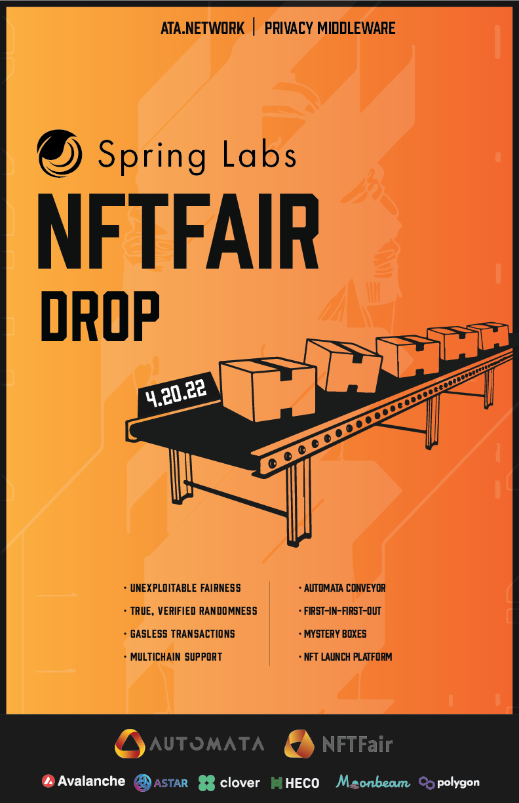
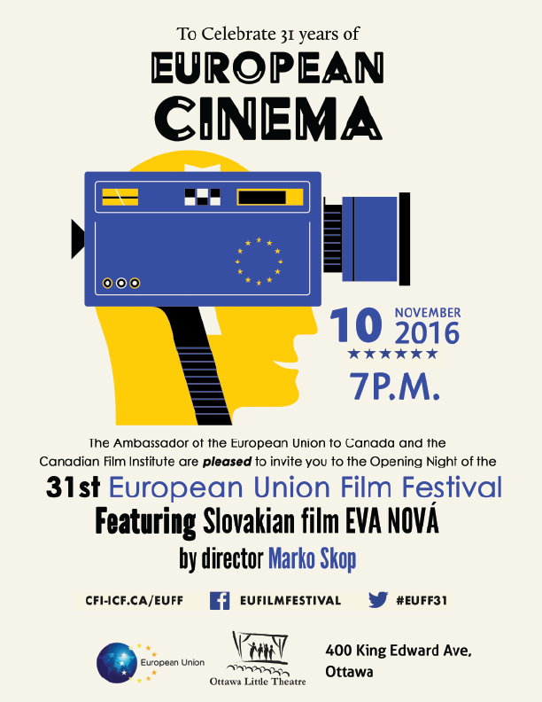

# Posters

## ATA Network

[ATA Network](https://www.ata.network/)

ATA Network is a blockchain company that acts as a privacy middleware. The following two posters were an assignment from one of the recruiters.

### Concept 1

### Concept2

## European Cinema

[European Cinema](https://www.cfi-icf.ca/)

> The Canadian Film Institute’s (CFI) mission is to encourage and promote the production, diffusion, study, appreciation and use of moving images for cultural and educational purposes in Canada and abroad.

### Print Three Ottawa

[Print Three Ottawa](https://www.print3ottawa.com/)

Print Three is a Canadian company that provides print, web, and marketing services. I was employed as a graphic designer but I also did a lot of UX research because the company was looking to expand into the web market. The reasons were obvious as most business nowadays in conducted online and print material has a dedicated clientele.

> The Print Three location in Ottawa is owner operated and caters to many different kinds of clients, including students, corporate clients, government clients at all levels of government, and many others.

### Concept 1

I took inspiration from graphic posters that I had seen around town and wanted to give it a modern look. I used Adobe Illustrator to create the two versions below.

### Concept 2

