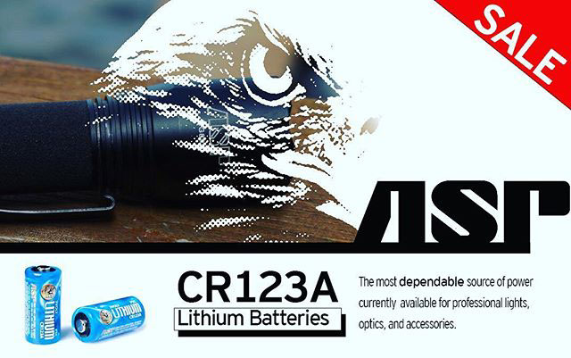
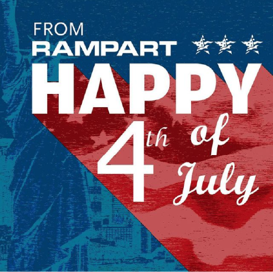

# Social Media

## Lighthouse Labs

[Lighthouse Labs](https://www.lighthouselabs.com)

## Rampart

#### About the company

[Rampart Corp](https://rampartcorp.com/)

> CANADA'S LEADING SUPPLIER OF OPERATIONAL EQUIPMENT

They serve the following demographics:

- Military
- Police: Federal, Provincial, Municipal
- Corrections
- Wildlife and Conservation
- Armed Government Services
- Public Safety and security
- Fire: Wildland and Structure

#### My role

I was employed as a graphic designer and data entry clerk. The company at the time used Shopify to sell their merchandise. Their facility was huge with a strict code due
to the nature of the items.

#### Shopify

A canadian company that is taking on the big names like Amazon. With a monthly subscription, it's possible to setup an online store and manage your content easily. Shopify has lots of templates for sale. Personally, I am interested in creating my own frontend with Vue JS and using the Shopify API to consume data.

## Projects

These posts were made for Instagram and Facebook. The company has a sizable following and they mainly promote their new items or discounts through these channels. Engaging with the customers is by far the most powerful way to retain clients and possibly bring in new ones.

### Promotion for batteries

### Canada day celebrations

The design behind this involved using a lot of red colors, with the Parliament buildings in the background with fireworks. The foreground is a pathway that runs along the Ottawa River where pedestrians can walk or bike. It's beautiful in the summertime.

### July 4th

This piece is for the American audience

