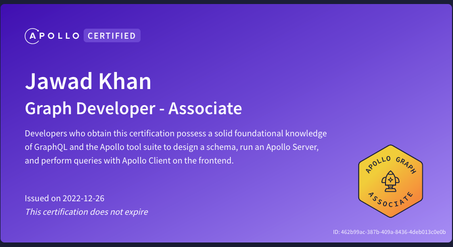

## Software

The following list highlights the main frameworks/libraries and software that I use to design and build websites and apps. My focus is strictly in Frontend Development and digital asset creation.

| Category        | Software                                                                                              | Description                                               |
| --------------- | ----------------------------------------------------------------------------------------------------- | --------------------------------------------------------- |
| Development     | [React](https://reactjs.org), [Vue](https://vuejs.org), [SvelteKit](https://kit.svelte.dev/)          | front-end development, `tailwind`, responsive, accessible |
| Design          | [Adobe CC](https://www.adobe.com/ca/creativecloud.html), [Figma](https://figma.com)                   | Photoshop, Illustrator, XD, After Effects, Premiere Pro   |
| Testing         | [Playwright](https://playwright.dev/)                                                                 | JavaScript Testing framework                              |
| CMS             | [WordPress](https://wordpress.org), [Sanity](https://sanity.io)                                       | Oxygen Builder, WPGraphQL, WooCommerce                    |
| Database        | [PostgreSQL](https://www.postgresql.org/)                                                             | SQL, psql, Supabase                                       |
| Version Control | [Git](https://git-scm.com/), [Github](https://github.com/)                                            | Industry standard. Great for collaboration and teams      |
| Containers      | [Docker](https://www.docker.com/)                                                                     | Basic setup of containers for cross-platform development  |
| Cloud           | [AWS](https://aws.amazon.com/?nc2=h_lg), [Vercel](https://vercel.com), [Netlify](https://netlify.com) | S3 buckets, Heroku                                        |

## Certifications

### Apollo Graph Developer Associate

[Apollo](https://www.apollographql.com/) is a [GraphQL](https://graphql.org/) based solution that offers a web app to manage schemas, servers, playgrounds (for querying).

Link to the [PDF](./apollo-graphql.pdf)

#### Benefits of GraphQL

- Speed up front-end development
- Make it easier to query only the data that is required thus reducing load time and server resources
- Large community around the world supporting its development
- API can grow and evolve as the data and application evolve
