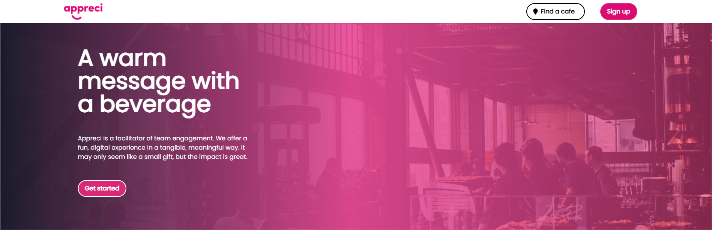
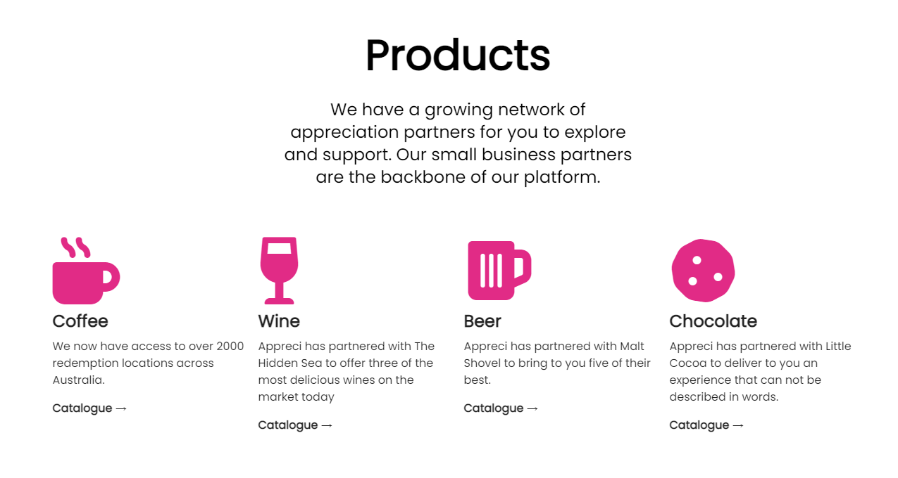
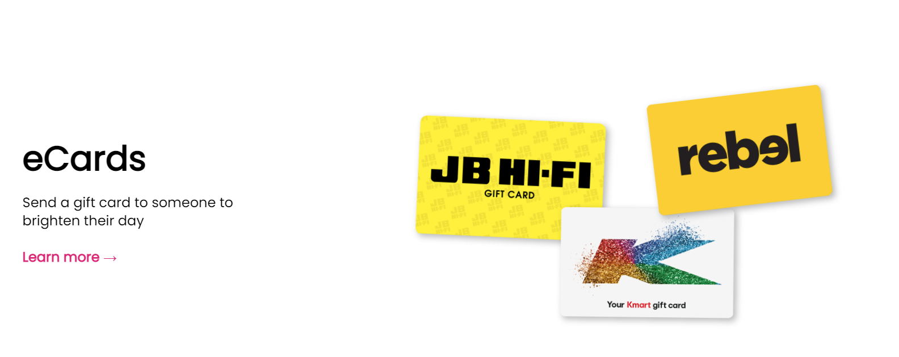

## Design prototype

[Landing Page](https://appreci.netlify.app)

## Overview

- Worked closely with the marketing team to optimize the design
- Created a new UI layout, UI patterns, and UX flows to make Call-to-action buttons more prominent
- Explained design decisions to project manager and stakeholders
- Conducted user research and usability testing to ensure the UX was smooth. Explored competitors websites.
- Made sure design was responsive for all devices

### Tech stack

- Vue JS
- Tailwind CSS
- Github
- Netlify
- WordPress
- Elementor

## Company details

[Official site](https://appreci.io)

Appreci is a company in Australia. Their business model is centered around sending gifts to colleagues or friends as a way of showing appreciation and gratitude. The benefit of this is to build trust which is essential to any functioning organization.

They have partnered with local businesses to grow their business and make the process of gifting easy and memorable.

> Appreci is a facilitator of team engagement. We offer a fun, digital experience in a tangible, meaningful way. It may only seem like a small gift, but the impact is great.

### Products

### Applications

- Integration with Microsoft teams
- Mobile app
- Desktop app

### How it works

1. Customer signs up on the main portal
2. Choose the items to be sent as a gift
3. Find the person either through email or their name if they are already in the database
4. Recipient can redeem a gift card or get the gift delivered to their address

## Main competitor

[Shouta](https://www.shouta.co/)

Similar in concept but with a stronger focus on the mobile app. Their strenghts include marketing by using social media to drive engagement.
