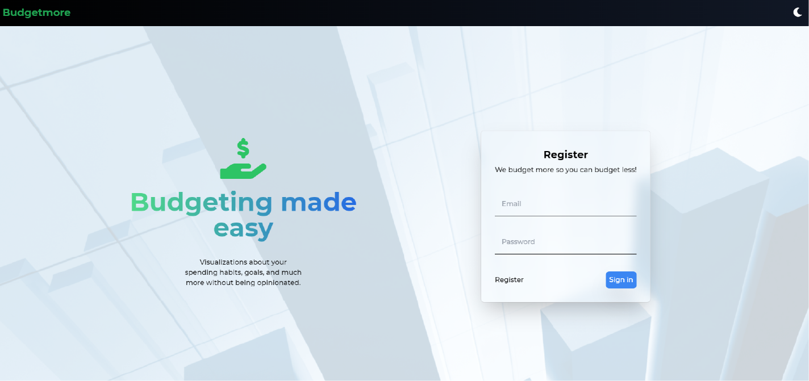
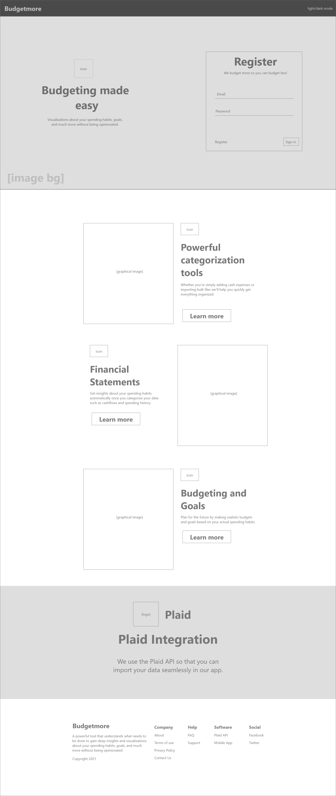
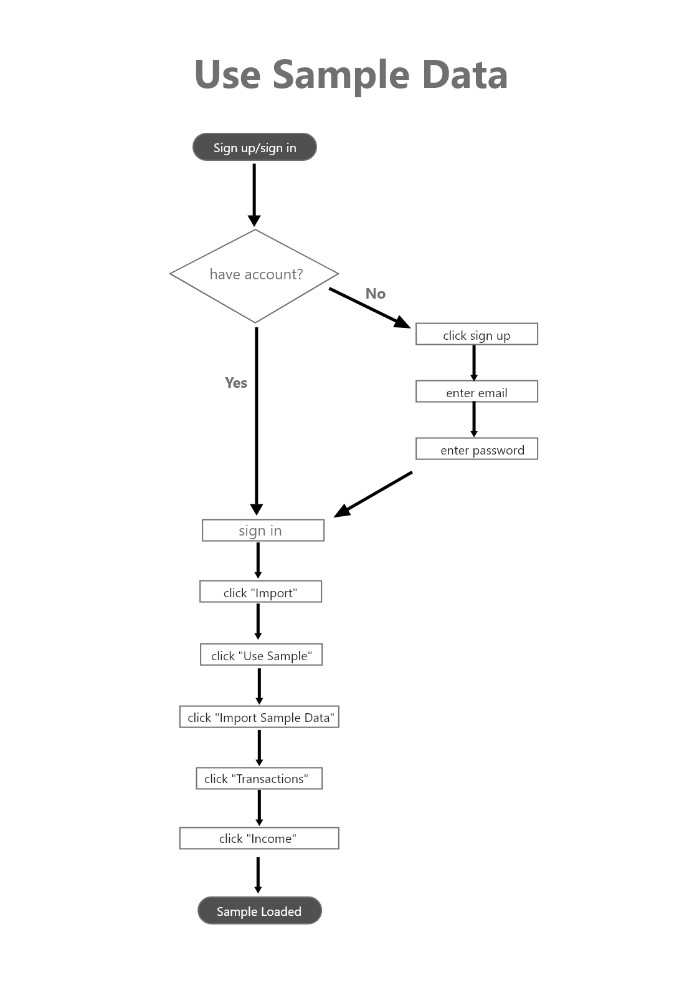
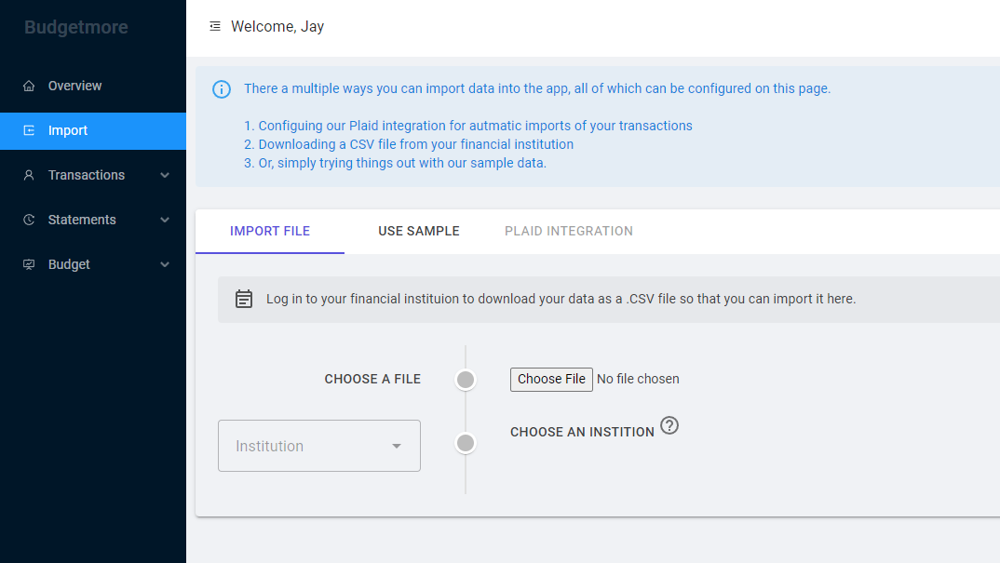
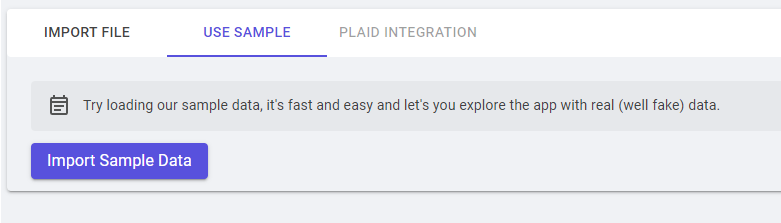
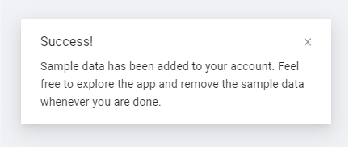
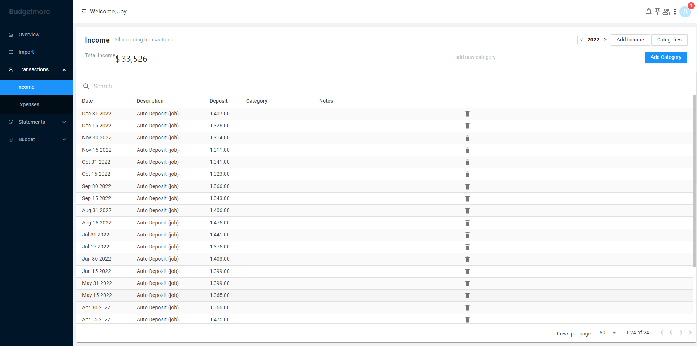

# Budgetmore

## Project Details

A budgeting application

[See Landing page prototype](https://budgetmore.netlify.app)

[See live project - Work in progress](https://budgetmore.com/)

### Overview

- Conducted user search and usability testing to check functionality of the application
- Created a new look and feel for the landing page
- Made sure design was responsive and worked on all devices
- Worked closely with developer to find the optimal design
- Created UI Patterns, UX flows, wireframes and prototypes

### Premise

The premise of the application is to help regular people with budgeting. This is achieved by importing data from a bank account and uploading it to the application for analysis. The idea is to make it intuitive and easy to look at the data point and find some insight or organization in managing finances.

### Tech stack

- Vue JS
- Tailwind CSS
- Github
- Netlify

The backend developer used the following:

- Mudblazor
- CSV files for mock data
- Plaid API

## Wireframes

The landing page is rather simple. The only interaction is really in the login/signup section. The footer is an overview of the whole project but since the backend is still being worked on, all the individual pages need copy and a design.

## User Flows

The user flow is about uploading sample data to play around with. It requires that you signup first and then import the sample data to play around with.

## Backend

The backend was made by [Joseph Mawer](https://www.linkedin.com/in/joseph-mawer-062a677b/).

The user is taken to the backend which is being written in [C#](<https://en.wikipedia.org/wiki/C_Sharp_(programming_language)>) and [Mudblazor](https://mudblazor.com/) on the [.NET](https://dotnet.microsoft.com/en-us/) platform from Microsoft. In the screen shot below we change to the **Import** page.

By clicking on the 'Import Sample Data' button in purple, we can then use made up data to play around with.

If everything works, there should be a success message in the bottom right corner.

Finally, by switching to the Income page, we can see the sample data. As you can see, there are more functions and features, but these are currently being worked on by the main developer.

