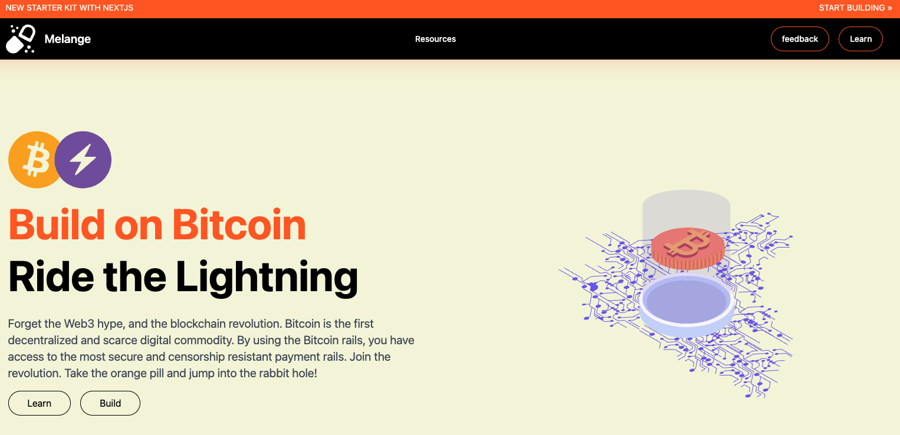
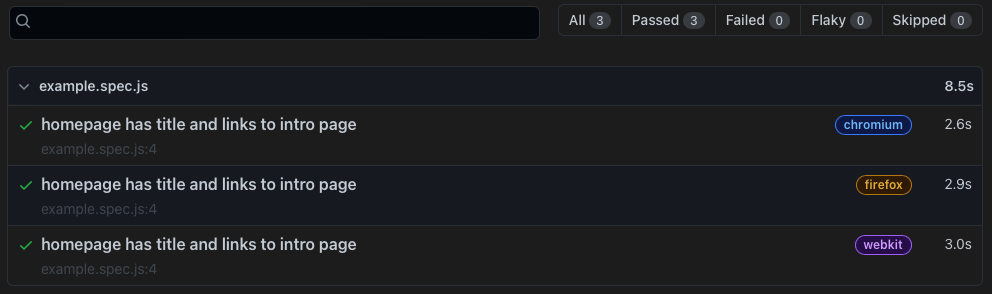

---



## Project Overview

[See Prototype](https://bitcoin-melange.vercel.app)

**Work in progress**

Melange is dedicated to building on Bitcoin. With the increased adoption of the Bitcoin Lightning network, I believe more people are seeing the value of using an open, permissionless and immutable blockchain.

There are a few points to be made about the "crypto" and "blockchain" industries.

1. Blockchain is not a new technology and is by no means the most efficient database nor was it meant to be. Bitcoin is a revolutionary technology that built upon the ideas of other cryptographers, programmers and computer scientists.
2. Crypto is more or less a derivative of Bitcoin because when Satokshi Nakamoto solved the double spending problem, he/she effectively created digital scarcity for the first time in history.

For this reason, Melange exists exclusively to build services and products that use the Bitcoin rails for conducting business whether domestically or internationally.

## Purpose

Melange is focused on building Bitcoin based apps. This is a stark contrast to the so called 'dapps' and 'web3' applications running on Ethereum. In my opinion these are marketing terms that don't hold much value. By studying the blockchain space, it became more apparent that the the business models of start-ups who use Ethereum follow the exisiting fiat based models such as Venture Capitalists.

A Bitcoin economy is vastly different because most people would rather hold their bitcoins. This means that a business that uses savings has a solid foundation and the incentive to produce something of value is paramount otherwise the risk of failure will always loom over any venture.

## Roadmap

Melange focuses on the software side of the Bitcoin standard. This will include JavaScript and Python mainly because these are very well known and easier to learn.

The goal is to create a community of developers who are aligned on one thing: Bitcoin.

## Testing

Being a frontend developer requires testing UIs for different scenarios. The following tests are for simple SEO checks.

```tsx
import { test, expect } from "@playwright/test";

test("SEO title is present", async ({ page }) => {
  await page.goto("http://localhost:3000");
  await expect(page).toHaveTitle(/Melange/);
});
```

Results:



## Tech Stack

- Next JS
- Tailwind CSS
- Flowbite
- Framer Motion
- React Three Fiber, Drei, Cannon,
- Spline
- Playwright
