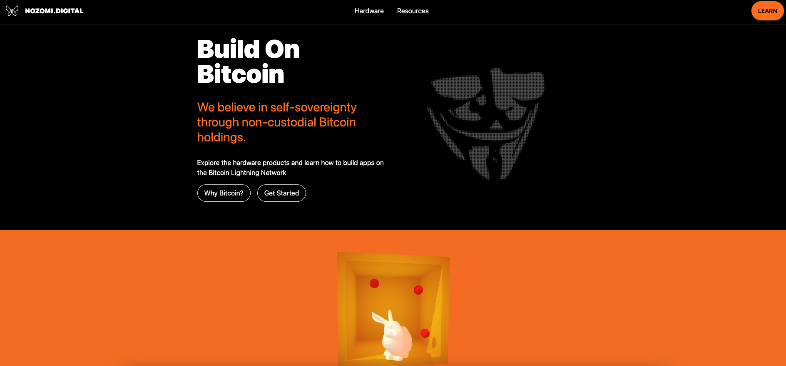

## Project Overview

[See Prototype](https://nozomi-digital.vercel.app)

**Work in progress**

Nozomi Digital is dedicated to building on Bitcoin. With the increased adoption of the Bitcoin Lightning network, I believe more people are seeing the value of using an open, permissionless and immutable blockchain.

There are a few points to be made about the "crypto" and "blockchain" industries.

1. Blockchain is not a new technology and is by no means the most efficient database nor was it meant to be. Bitcoin is a revolutionary technology that built upon the ideas of other cryptographers, programmers and computer scientists.
2. Crypto is more or less a derivative of Bitcoin because when Satokshi Nakamoto solved the double spending problem, he/she effectively created digital scarcity for the first time in history.

For this reason, Nozomi Digital exists exclusively to build services and products that use the Bitcoin rails for conducting business whether domestically or internationally.

Finally, Nozomi (which means hope in Japanese) was inspired by [hope.com](https://hope.com) and the focus on Bitcoin for learning purposes.

## Purpose

Nozomi is focused on building Bitcoin based apps. This is a start contrast to the so called 'dapps' and 'web3' applications running on Ethereum. In my opinion these are marketing terms that don't hold much value. By studying the blockchain space, it became more apparent that the the business models of start-ups who use Ethereum follow the exisiting fiat based models such as Venture Capitalists.

A Bitcoin economy is vastly different because most people would rather hold their bitcoins. This means that a business that uses savings has a solid foundation and the incentive to produce something of value is paramount otherwise the risk of failure will always loom over any venture.

## Roadmap

Nozomi focuses on the software side of the Bitcoin standard. This will include JavaScript and Python mainly because these are very well known and easier to learn.

The end goal is a to build a **Bitcoin app store**.

## Tech Stack

- Next JS
- Tailwind CSS
- DaisyUI
- Framer Motion
- React Three Fiber, Drei, Cannon,
- Spline
- Playwright

## Logos

A butterfly in one unbroken stroke.

