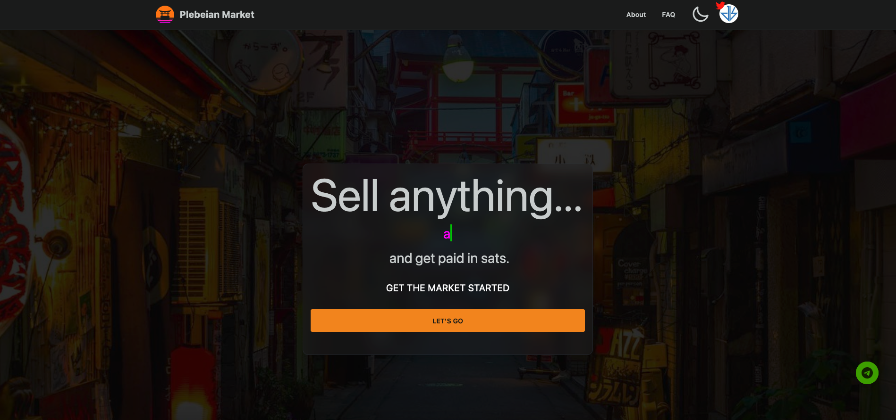

## Overview

### Links

[Live Site](https://plebian.market) - current live version that is functional. Requires a Lightning Wallet to login and transact.

[Github Repo](https://github.com/PlebeianTech/plebeian-market) - if you want to look under the hood

[Staging](https://staging.plebeian.market) - for testing

### About

Plebeian Market is an online marketplace that uses Bitcoin as the primary medium of exchange. A user can create a stall, list items for sale or for auctioning. What makes this project unique is the ability to auction your time, usually 1 hour. This is radical because there is nothing more valuable than time. What you decide to give your attention to is critical to a healthy and properous life.

> You will own your market stall and you will be happy.

## Bitcoin only

Bitcoin is the most well known of the cryptocurrencies for several reasons:

- It was the first to solve the [Double Spending] problem thus initiating digital scarcity.
- It has the biggest market cap and user base (in terms of wallets)
- It is the most secure of all the blockchains

#### Value 4 Value

Bitcoin is still a new technology and there are new use cases emerging with each passing season and bear market. When it comes to giving and receiving value, Bitcoin is best poised to enable content creators to trade with others in a fair, open and permissionless way that was not previously possible.

#### Lightning Tech

[The Lightning Network](https://en.wikipedia.org/wiki/Lightning_Network) is a nascent technology that allows Bitcoin to scale globally and service billions of people with potentially millions of transactions per second. This will rival current systems like Visa which take a substantial fee and require days or weeks for settlement.

#### Peer-to-Peer

P2P is a well-known paradigm that enables internet users to send value and transact directly with each other. Similar networks like Bittorrent popularized the concept long before Bitcoin. The inherit value in P2P is being able to bypass central authority who may change the rules as they wish.

## My role

I was tasked with redesigning the UI to make it look more modern. The client had already picked out Daisy UI, which is based on Tailwind CSS, so it made the development process more straightforward. Working on his project was and still is a great learning experience because it was my first exposure to Sveltekit which is a slick new web framework that is enjoyable and intuitive to build with.

## Tech stack

- [Sveltekit](https://kit.svelte.dev/)
- [Tailwind CSS](https://tailwindcss.com/)
- [Daisy UI](https://daisyui.com/)
- [Pycoin](https://github.com/richardkiss/pycoin)
- [Voltage](https://voltage.cloud/)
- [Flask](https://flask.palletsprojects.com/en/2.2.x/)
- [SQLAlchemy](https://www.sqlalchemy.org/)
