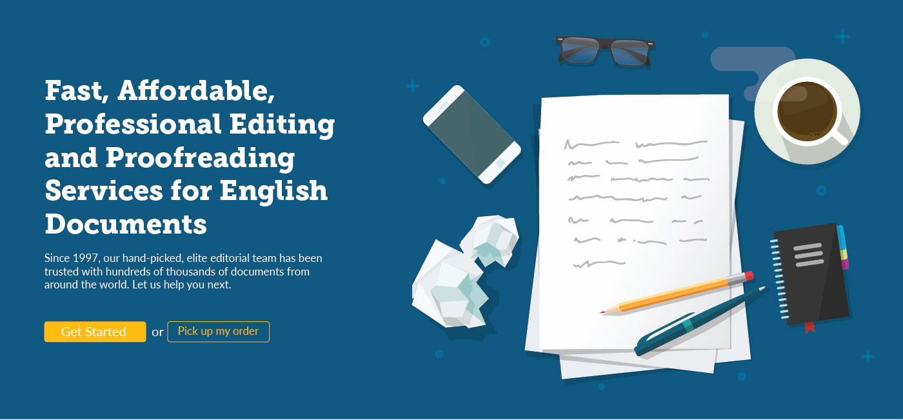
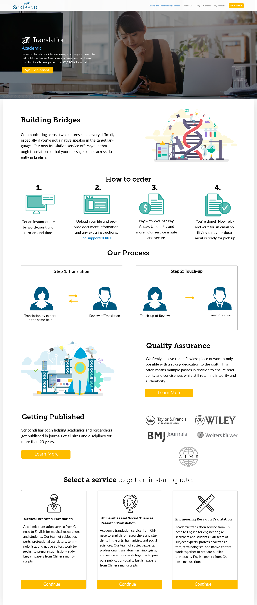
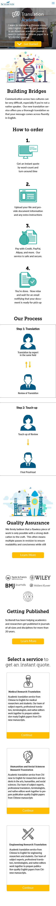
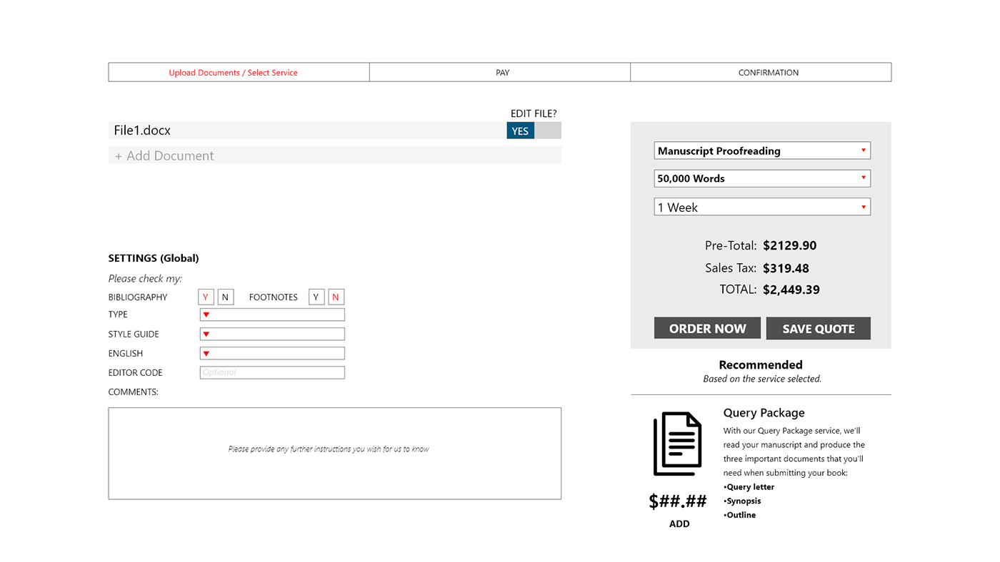
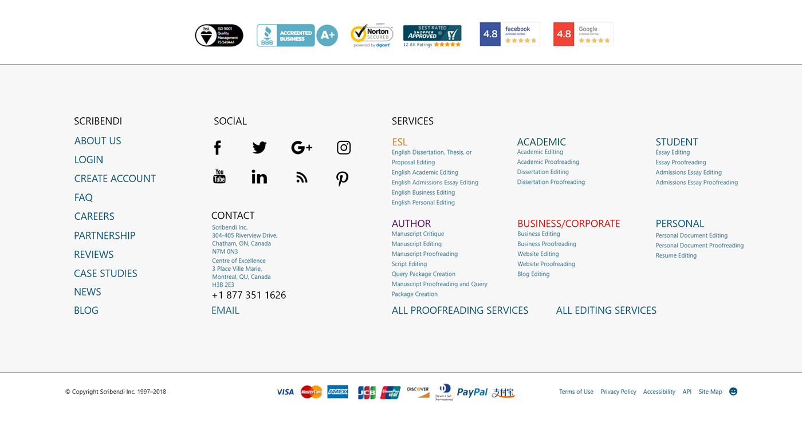
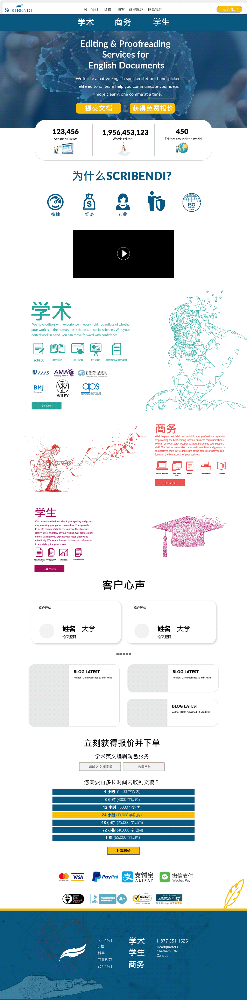

# Scribendi

## Overview

- Designing the best user experiences based on user research and using an evidence-based approach to achieve a consistent and seamless omnichannel experience.
- Developed UX processes, flows and used design tools to build UI patterns.
- Explained designs decisions to project manager. Owning features design. Knows when and how to involve stakeholders.
- Worked closely with graphic designers, developers and marketing team.
- Conducted user research and usability testing, organized and analyzed research findings for a better understanding of user insight, assist in wireframing, sketching, prototyping, and creating user flows.

### Tech stack

- Adobe XD
- Photoshop
- Illustrator
- Google Analytics
- CrazyEgg

## Company details

[Official site](https://www.scribendi.com)

Scribendi specializes in editing and proofreading English documents. It could be anything from a resume to a thesis. They have freelancers/professionals around the world who upload their changes onto the website. The website is what I worked on as a UI/UX designer.

## Graphic design for a magazine article

Below is a graphic design project for an article on AI and Natural Language Processing (NLP). I was going for an artistic and modern look. The original graphic was a single hummingbird that the writer had found on the internet. I added another hummingbird into the mix and changed the graphics so that it was just lines rather than colors.

## Marketing and Educational Videos

Using Adobe After Effects, I created a bunch of videos which received over 500,000 views all together.

[Scribendi: Editing and Proofreading for English Documents](https://www.youtube.com/watch?v=os7JezfFh8I) - _marketing video_

[25 second grammer: Semicolons](https://www.youtube.com/watch?v=AhDfTdAY1cU) - _educational video_

[The Top 10 Misspellings of "Scribendi"](https://www.youtube.com/watch?v=lj6KnVkdQqk)

## New home page design

In order to modernize the style, I went with a graphic oriented design that could then be animated. Stock photos have one drawback, which is that they are stock. I've seen the same stock photo for several different businesses, and people only faintly notice it because of how generic they look. If you are a company that you want to rebrand, I'd suggest keep stock photos to a minimum.

## Design for a new service

The company created a new service and asked for a design. The below screen was again more graphic oriented, with less text. Research has shown that visitors to the site don't like to read a novel, even if they are writers. They need a service, and that is why there are at your website. Always make it easy for the user to interact with the website.

## Mobile Version

## Wireframe for a new checkout system

For this design, my task was to break down the checkout system into fewer steps. After going through the checkout they had at the time, I noticed that it took too long and the forms required lots of information. I cut down the steps by two and made sure the price was always present, similar to how Amazon does it.

I enjoyed this project because I learnt about e-commerce and how important the UX is in order to retain customers. The prototype was built with Adobe XD.

## Footer redesign

## Chinese Homepage

The company decided to expand into China. This was at a time when relations weren't so bad, around 2019, but cracks were starting to appear. I made this with an artistic mindset, to step outside the comfort-zone and create a new look and feel. What I researched of Chinese sites brought to light that a busy site is what the East Asian consumer expects. Being Asian I can that this is a general assumption to make, but one that reflects the reality of living in Asia's major cities.

English is seen as a good skill to have in the international market which is why parents and students will spend money to learn it and have it edited.

