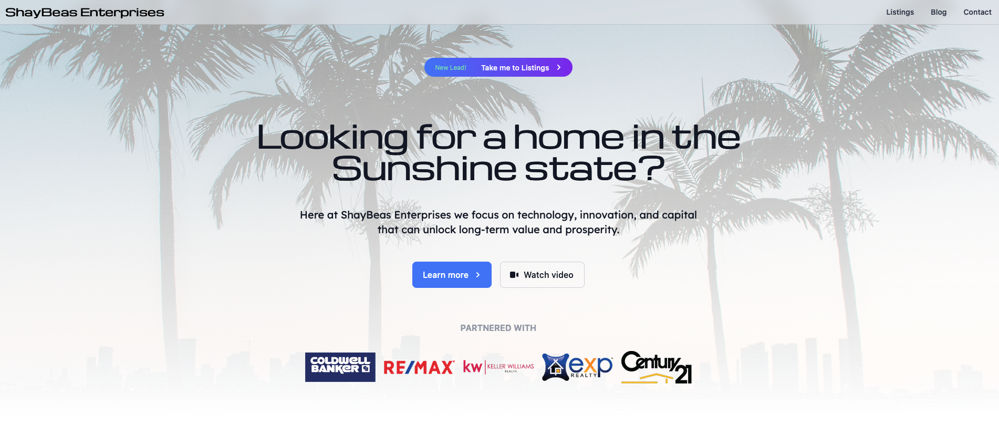
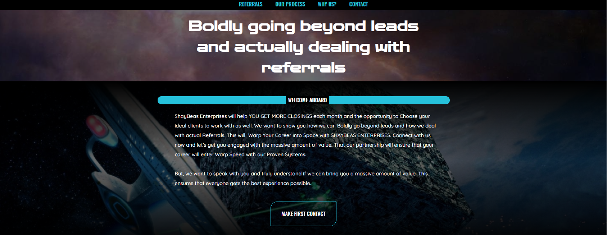

# ShayBeas Enterprises

## Overview

- Designed the landing/marketing site for a client in Florida in the Real Estate industry
- Created a new UX flow and UI patterns using design tools and Next JS
- Worked closely with stakeholders, marketing team, and developers
- Conducted usablity testing for responsiveness, site speed and SEO

## New Version

Made with NextJS and Tailwind CSS. This is a prototype that is setup so that connecting to external APIs or adding functionality like search is possible.

[See New Prototype](https://next-shaybeas.vercel.app)

#### Process

1. Determine the layout by creating a wireframe on paper or Figma
2. Create Layout using NEXT JS, Tailwind CSS
3. Add interactivity and animation
4. Add database if necessary
5. Test with Jest

#### Why NextJS?

- Modern technology with a huge developer base. Keeping up-to-date with the latest in front-end developement.
- SEO optimization built in and customizable
- Powerful features and libraries that make development faster like GSAP for animation
- Easy hosting (Vercel, Netlify)
- Static Site Generation - faster page loads
- Server Side Rendering - for fetching data
- API Routes - if you want to build an API

## Old Version

[See design](https://shaybeas.webflow.io)

This version is the original design I made with Webflow. I have since stopped using Webflow because it is limited in its free plan. Considering I planned on making many websites and apps, this would easily add up to hundreds if not thousands of dollars. Besides I'm much more interested in writing code anyways.

## Company details

Shaybeas Enterprises is a real estate company in Florida, USA. They specialize in taking leads and turning them into clients. Their unique business model involves using a CRM to build relationships with home sellers and buyers.

The client requested a Star Trek themed design. The inspiration was from [First Contact](https://www.imdb.com/title/tt0117731/)
